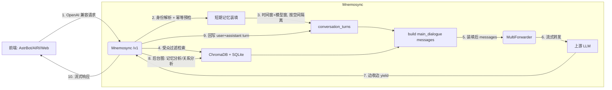

# Mnemosync

<div align="center">

**跨平台人格记忆同步代理 | Cross-Platform Persona Memory Sync Proxy**

[](https://www.gnu.org/licenses/agpl-3.0)
[](https://github.com/Mnemosync/Mnemosync)
[](https://www.python.org/)
[](https://fastapi.tiangolo.com/)

```text
╭───────────────────────────────────────────────────────────────╮
│                                                               │
│  │  ╲╱  ││ \ │ ││  ___│  ╲╱  │  _  ╱  ___\ ╲ ╱ / ╲ │ /  __ ╲  │
│  │ .  . ││  \│ ││ │__ │ .  . │ │ │ ╲ `──. \ V /│  ╲│ │ /  ╲╱  │
│  │ │╲╱│ ││ . ` ││  __││ │╲╱│ │ │ │ │`──. ╲ ╲ / │ . ` │ │      │
│  │ │  │ ││ │\  ││ │___│ │  │ │ \_/ ╱╲__╱ ╱ │ │ │ │╲  │ \__╱╲  │
│  \_│  │_╱╲_│ ╲_╱╲____╱╲_│  │_╱╲___╱╲____╱  \_/ ╲_│ ╲_╱╲____╱  │
│                                                               │
│                         Mnemosync                             │
│                          v0.3.0                               │
│                                                               │
╰───────────────────────────────────────────────────────────────╯
```
**同一人格，任意前端 | One Persona, Any Frontend**

</div>

---

## 📖 项目简介

**Mnemosync** \/niːˈmɒzɪŋk\/ 是一个专为 LLM 人格扮演设计的**中间代理服务器**。

在当前的 LLM 生态中，用户往往需要在多个平台（如 AIRI 桌宠、AstrBot 机器人、Web 聊天室）之间切换。传统架构导致**上下文记忆分散**：你在桌宠上告诉模型的名字，机器人并不知道；你在工作中培养的人格，回家后无法延续。

Mnemosync 在网络层拦截 OpenAI 兼容请求，**服务器持有对话真相**，把所有前端的对话汇聚成一条连续流后再转发给上游模型。它不仅是代理，更是人格记忆的同步器。

> **名字由来**：Mnemosyne（希腊神话记忆女神）+ Sync（同步）。

---

## ✨ 核心特性

- **👥 单人格多用户 (v0.3.0)**
  一个实例一个人格, 同时服务多个真实用户。API Key 绑定**身份识别策略** (direct / api_key_bound / regex / llm), 服务器侧从请求中提取参与者 (Actor): AstrBot 的 QQ 号、ChatBox 的固定用户、或模型语义识别。**跨平台身份归一**: 把同一人在不同平台的 Actor 绑进一个用户组 (UserGroup), 记忆与关系以有效用户 ID 为边界共享。群聊按空间 (space) 分区成独立对话流, 记忆检索**先按受众过滤再交给模型**——其他参与者的私有记忆不会泄入上下文。未绑定策略的 Key 进入非归属模式 (不建身份、不读写私有记忆、照常回复)。平台重发消息按事件 ID 幂等重放, 不烧重复 token。

- **🧠 跨前端连续对话 (v0.2.6)**
  服务端维护 `conversation_turns` append-only 流水，所有前端 (AstrBot / AIRI / Web / SDK) 写入同一 bucket。装填时**忽略客户端携带的历史**，只取最后一条 user 消息，其余上下文由服务器双窗装填 (时间窗默认 7d + 模型窗按 `context_length` 从最老那端裁剪)。换前端不失忆，客户端 UI"清空"也不会抹掉服务器的连续记忆。

- **🎭 服务器优先人格 (Server-First Persona)**
  人格由服务器 `[persona]` 段权威定义，客户端 system 消息走**提示词清洗 Agent** 剥离人格描述、保留功能性指令。第三方前端注入的角色扮演不会污染人格。

- **🔌 OpenAI 兼容接口**
  遵循 OpenAI API `/v1/chat/completions` 标准 (流式 / 非流式)。前端只需改 API Base 与 Key，即可无缝接入 AstrBot、AIRI、NextChat 等平台。

- **🗄️ 智能长期记忆**
  ChromaDB 向量库 + SQLite 元数据 + 时间衰减模型。永久记忆 (核心事实) 常驻；普通记忆按重要性/衰减/过期动态管理。支持背景 Reindex 与低价值记忆 Prune (v0.2.4)。

- **🔧 多服务商模型绑定 (v0.2.3+)**
  main / assist / embedding / rerank 四种角色各自维护优先级候选列表 (存 `role_bindings` 表)。主对话与辅助 Agent 上游失败自动 fallback；**嵌入角色单绑定** (v0.2.4)，换嵌入模型必须走 Reindex 走完再服务。

- **✏️ 提示词两层可覆盖 (v0.2.1)**
  记忆分析 / 关系分析 / 代理推理 / 提示词清洗 / 主对话框架等 Agent 提示词以 Markdown 文件形式随包发布 (默认层)，可在 `data/prompts/` 覆盖。通过 `mnemosync prompt` CLI 或面板 `/panel/admin/prompts` 即时生效，无需重启。

- **🛠️ 调试面板 (v0.2.5)**
  Web UI 内嵌调试聊天页 + HTTP hop 观测：每次请求的进出方向、body、耗时都通过 SSE 推给面板，支持流式 chunk 组装。

- **🚀 轻量级部署**
  Python 3.12+ / FastAPI / SQLite / ChromaDB (本地嵌入式)。支持 Docker 一键启动。

---

## 🏗️ 架构原理

Mnemosync 的核心不变量是 **"服务器持有真相"**：人格由服务器权威持有；每个真实用户 (有效用户 ID) 一条连续对话流、一份私有记忆；群聊空间是独立的对话分区。



详细拓扑与 Agent 分工见 [docs/architecture.md](./docs/architecture.md), 身份体系见 [docs/modules/identity.md](./docs/modules/identity.md)。

---

## 🔑 API Key 与身份识别

**v0.3.0 起为单人格多用户架构** —— 一个 Mnemosync 实例 = 一个人格, 服务多个真实用户。

API Key (每前端一枚) 的双重作用:

- **区分前端来源**: `api_key.note` 作为 `source_frontend` 元数据写入 `conversation_turns` (v0.2.6), 仅用于观测
- **绑定身份策略** (v0.3.0): `strategy_id` 指向身份识别策略, 决定如何从请求中提取参与者。未绑定的 Key 进入**非归属模式**——不建立身份、不读写任何私有记忆, 但仍可正常回复

典型配置: AstrBot 群 → regex 策略 (从 prompt 文本提取 QQ 号/群号); ChatBox → api_key_bound 策略 (Key 即身份); 规范客户端 → direct 策略 (读 `request.user` 字段)。同一人在不同平台的身份可在面板「身份管理」页或 `mnemosync identity` CLI 中绑定归一。多人格仍是未来规划 (`persona_id` 字段已预留)。

---

## 🚀 快速开始

### 方式一：Docker 部署

```bash
git clone https://github.com/Mnemosync/Mnemosync.git
cd Mnemosync
docker compose up -d
docker compose logs -f
docker compose exec mnemosync uv run mnemosync init
```

### 方式二：源码部署

```bash
# 安装 uv (若未装)
curl -LsSf https://astral.sh/uv/install.sh | sh

git clone https://github.com/Mnemosync/Mnemosync.git
cd Mnemosync

# 1. 复制配置模板并填 [persona] / 服务商凭证
cp config.example.toml config.local.toml
$EDITOR config.local.toml

# 2. 安装依赖
uv sync

# 3. 初始化数据库
uv run mnemosync init

# 4. 启动服务
uv run mnemosync serve
```

启动后:
- OpenAI 兼容层: `http://localhost:16125/v1/chat/completions`
- 管理面板: `http://localhost:16125/` (Vue UI, 需登录)
- 默认账号密码: `mnemosync` / `mnemosync` (首次登录后请改)

### 首次使用

```bash
# 登录交互式 shell
uv run mnemosync login

Mnemosync > generate-key
> AstrBot          # 前端 note, 会作为 source_frontend
sk-qwertyuiop...   # 保存

# 在面板"模型管理"页面绑定 main / assist / embedding / rerank
# 或用 CLI:
Mnemosync > model add main dashscope qwen-max
Mnemosync > model add embedding dashscope text-embedding-v3 --dim 1024
```

### 配置多用户身份 (v0.3.0)

不配置身份策略也能用 (非归属模式: 不建身份、不读写私有记忆、照常回复)。要让记忆按用户隔离:

```bash
# 以 AstrBot 群为例: 创建 regex 策略, 从 prompt 文本提取 QQ号/群号
mnemosync identity strategy create --name "AstrBot QQ" --type regex \
    --frontend astrbot \
    --actor-pattern 'QQ号[:：]\s*(\d+)' \
    --name-pattern '用户名[:：]\s*(\S+)' \
    --space-pattern '群号[:：]\s*(\d+)'

# 在面板「API Key」页创建 Key 时绑定该策略 (或 identity CLI 管理策略)
# 之后同一人在不同平台的身份可在面板「身份管理」页绑定归一:
mnemosync identity group create --name 张三
mnemosync identity bind <actor_id> <group_id>
```

### 接入前端

在客户端 (AstrBot / AIRI / NextChat / ...) 修改模型提供商:
- **API 地址**: `http://your-server:16125/v1`
- **API Key**: 上一步生成的 `sk-xxx`
- **模型名**: 填 `mnemosync-any` 或留空 (由代理层根据 `role_bindings` 接管)

---

## 📚 文档索引

- [架构总览](./docs/architecture.md) — 分层、Agent 拓扑、数据流
- [配置指南](./docs/configuration.md) — `config.local.toml` 各段字段
- [认证与鉴权](./docs/auth.md) — API Key / Session / admin 路由
- [部署指南](./docs/deployment.md) — Docker / 源码 / 备份
- [开发决策记录](./docs/dev-decisions.md) — 各版本重大设计决策
- 模块文档: [modules/](./docs/modules/)
  - [身份管理](./docs/modules/identity.md) — 策略 / 参与者 / 用户组 / 空间事件流 / 幂等 (v0.3.0)
  - [记忆系统](./docs/modules/memory-system.md) — 长期 + 短期双窗装填 + 受众过滤
  - [Agent 与提示词](./docs/modules/agents.md)
  - [LangGraph 编排](./docs/modules/langgraph.md)
  - [消息处理管道](./docs/modules/message-processing.md)
  - [Forward 转发路径](./docs/modules/forward.md)
  - [LLM 服务商与 role_bindings](./docs/modules/llm-service.md)
  - [工具](./docs/modules/tools.md)
  - [CLI](./docs/modules/cli.md)

---

## 📜 开源协议

**GNU Affero General Public License v3.0 (AGPL-3.0)**。

- 修改后必须开源修改版本
- 作为网络服务提供给他人时必须提供源码
- 如需闭源集成 / 商业 SaaS 请联系作者获取商业授权

---

## 🛣️ 开发路线图

- [x] **v0.1** — 确定性管道
- [x] **v0.2.0** — LangGraph 多 Agent + ChromaDB + 代理思考
- [x] **v0.2.1** — 提示词两层覆盖 + 服务器优先人格 + `/panel` 路由前缀
- [x] **v0.2.3** — `role_bindings` 单一真相源, 多服务商候选 + fallback
- [x] **v0.2.4** — 嵌入单绑定 + Reindex + Prune + 元数据字段
- [x] **v0.2.5** — 调试聊天面板 + HTTP hop 观测
- [x] **v0.2.6** — 跨前端短期记忆双窗装填
- [x] **v0.2.7** — `POST /panel/admin/persona/reset` 原子清空业务数据
- [x] **v0.2.8** — CLI `--debug` 全链路请求/响应落库 (`data/http_logs.db`)
- [x] **v0.2.9** — `[persona.relation]` 三字段基线 (`persona_addressing / user_addressing / context`), 默认人格改为"宅家内向的妹妹"
- [x] **v0.2.10** — 关系称呼动态演化: `update_addressing` tool + `relationship_audit_log`; 面板编辑对话框 + 变更历史 + 回退
- [x] **v0.2.11** — 人格面板编辑 (`data/persona_override.toml` 热重载); `MemoriesPage` 全列 sortable + filter; 亲密度 / 信任度按数值分档着色; SVG favicon 品牌图标
- [x] **v0.3.0** — **单人格多用户**: 身份识别策略 (绑定 API Key) + 参与者/用户组跨平台身份归一 + 非归属模式; 群聊空间事件流 + 幂等重放; 记忆受众过滤; 面板「身份管理」页 + `mnemosync identity` CLI
- [ ] **未来** — 多人格 (`persona_id`) / 人格自我演化 / 群聊摘要与检查点

---

## 🤝 参与贡献

欢迎提交 Issue / PR。请先阅读 [dev-decisions.md](./docs/dev-decisions.md) 了解现有设计约束（尤其是"不能修改客户端行为""服务器优先人格"两条硬边界）。

---

<div align="center">

**Mnemosync** | 让每一次对话都延续记忆的温度

[📄 架构](./docs/architecture.md) &nbsp;•&nbsp; [📚 配置](./docs/configuration.md) &nbsp;•&nbsp; [🧠 记忆系统](./docs/modules/memory-system.md) &nbsp;•&nbsp; [🔧 开发决策](./docs/dev-decisions.md)

</div>
