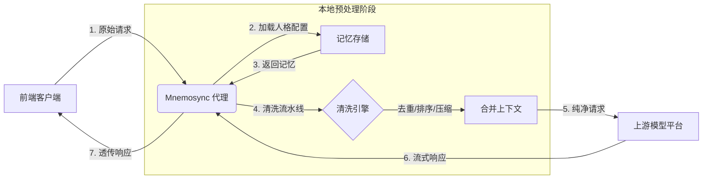

# Mnemosync

<div align="center">

**跨平台人格记忆同步代理 | Cross-Platform Persona Memory Sync Proxy**

[](https://www.gnu.org/licenses/agpl-3.0)
[](https://github.com/Mnemosync/Mnemosync)
[](https://www.python.org/)
[](https://fastapi.tiangolo.com/)

```text
╭───────────────────────────────────────────────────────────────╮
│                                                               │
│  │  ╲╱  ││ \ │ ││  ___│  ╲╱  │  _  ╱  ___\ ╲ ╱ / ╲ │ /  __ ╲  │
│  │ .  . ││  \│ ││ │__ │ .  . │ │ │ ╲ `──. \ V /│  ╲│ │ /  ╲╱  │
│  │ │╲╱│ ││ . ` ││  __││ │╲╱│ │ │ │ │`──. ╲ ╲ / │ . ` │ │      │
│  │ │  │ ││ │\  ││ │___│ │  │ │ \_/ ╱╲__╱ ╱ │ │ │ │╲  │ \__╱╲  │
│  \_│  │_╱╲_│ ╲_╱╲____╱╲_│  │_╱╲___╱╲____╱  \_/ ╲_│ ╲_╱╲____╱  │
│                                                               │
│                         Mnemosync                             │
│                         v0.0.0                                │
│                                                               │
╰───────────────────────────────────────────────────────────────╯
```
**同一人格，任意前端 | One Persona, Any Frontend**

</div>

---

## 📖 项目简介

**Mnemosync** \/niːˈmɒzɪŋk\/ 是一个专为 LLM 人格扮演设计的**中间代理服务器**。

在当前的 LLM 生态中，用户往往需要在多个平台（如 AIRI 桌宠、AstrBot 机器人、Web 聊天室）之间切换。传统架构导致**上下文记忆分散**：你在桌宠上告诉模型的名字，机器人并不知道；你在工作中培养的人格，回家后无法延续。

Mnemosync 通过在网络层拦截请求，**在转发给模型前统一预处理上下文**，将多端对话合并为**单一连贯会话（Single Coherent Session）**。它不仅是代理，更是人格记忆的同步器，模拟人类记忆的连续性与情境性。

> **名字由来**：Mnemosyne（希腊神话记忆女神）+ Sync（同步）。旨在孕育连续、有灵魂的对话体验。

---

## ✨ 核心特性

- **🧠 人格记忆同步**
  打破平台壁垒，无论通过 QQ、微信还是桌面端对话，模型始终记得"你是谁"以及"之前的约定"。

- **🛡️ 提示词智能清洗**
  在请求发出前完成**去重、时序排序、上下文压缩**。确保发送给模型的每一条消息都是纯净、有序且符合 Token 限制的。

- **🔌 OpenAI 兼容接口**
  完全遵循 OpenAI API 标准。只需修改前端配置的 API Base 和 Key，即可无缝接入 AstrBot、AIRI、NextChat 等任意兼容平台。

- **🧠 智能记忆系统**
  双类型记忆模型（永久记忆 + 普通记忆），模拟人类记忆的衰减与遗忘。
  - 永久记忆：核心信息（名字、过敏）永久保留，偏好记忆可覆盖
  - 普通记忆：按重要性、衰减速率、过期时间动态管理

- **🚀 轻量级部署**
  基于 Python + FastAPI 构建，支持 Docker 一键启动，资源占用极低，适合个人服务器或本地部署。

---

## 🏗️ 架构原理

Mnemosync 的核心设计原则是 **"预处理优先 (Pre-process First)"**。所有记忆合并与清洗均在本地完成，确保上游模型接收到的永远是最终状态。



### 关键流程
1.  **拦截**：接收前端发送的 OpenAI 兼容请求。
2.  **合成**：根据 API Key 识别前端来源，加载统一的人格配置与历史记忆。
3.  **清洗**：执行哈希去重、时间戳标准化、长上下文压缩。（可根据前端来源差异化处理）
4.  **转发**：将处理后的 `messages` 发送给上游模型（OpenAI/OneAPI/本地模型）。
5.  **透传**：将模型响应流式返回给前端，无感知延迟。

---

## 🔑 API Key 说明

> **重要**：当前版本为**单人格架构** —— 一个 Mnemosync 实例对应一个人格配置。
>
> API Key 的作用是**区分不同前端来源**，而非多用户隔离：
>
> | Key | 前端 | 用途 |
> |-----|------|------|
> | `sk-abc...` | AstrBot 机器人 | 机器人格式清洗 |
> | `sk-def...` | AIRI 桌宠 | 桌宠交互优化 |
> | `sk-ghi...` | Web 聊天室 | 网页聊天适配 |
>
> 所有 Key 共享同一份记忆池和人格配置。多人格支持是未来规划。

---

## 🚀 快速开始

### 方式一：Docker 部署（推荐）

```bash
# 克隆仓库
git clone https://github.com/Mnemosync/Mnemosync.git
cd Mnemosync

# 启动服务
docker compose up -d

# 查看日志
docker compose logs -f

# 初始化服务（首次运行）
docker compose exec mnemosync uv run mnemosync init
```

### 方式二：源码部署

```bash
# 安装 uv（如果未安装）
curl -LsSf https://astral.sh/uv/install.sh | sh

# 克隆并安装
git clone https://github.com/Mnemosync/Mnemosync.git
cd Mnemosync
uv sync

# 初始化服务
uv run mnemosync init

# 启动服务器
uv run mnemosync serve
```

### 首次使用流程

```bash
# 1. 初始化服务
$ mnemosync init

Mnemosync initializing...
Building Docker image...
Initializing database...
Success!

Use `mnemosync login` to start the cli environment,
or use `mnemosync help` to get more information.

# 2. CLI 登录
$ mnemosync login

Starting Mnemosync service...
╭───────────────────────────────────────────────────────────────╮
│                                                               │
│  │  ╲╱  ││ \ │ ││  ___│  ╲╱  │  _  ╱  ___\ ╲ ╱ / ╲ │ /  __ ╲  │
│  │ .  . ││  \│ ││ │__ │ .  . │ │ │ ╲ `──. \ V /│  ╲│ │ /  ╲╱  │
│  │ │╲╱│ ││ . ` ││  __││ │╲╱│ │ │ │ │`──. ╲ ╲ / │ . ` │ │      │
│  │ │  │ ││ │\  ││ │___│ │  │ │ \_/ ╱╲__╱ ╱ │ │ │ │╲  │ \__╱╲  │
│  \_│  │_╱╲_│ ╲_│ ╲_╱╲____╱╲_│  │_╱╲___╱╲____╱  \_/ ╲_│ ╲_╱╲____╱  │
│                                                               │
│                         Mnemosync                             │
│                         v0.0.0                                │
│                                                               │
╰───────────────────────────────────────────────────────────────╯

Welcome to Mnemosync!
Please login with account and password.
The default account and password are all 'mnemosync'.
Account: mnemosync
Password: ********
✅ 登录成功!

# 3. 生成 API Key
Mnemosync > generate-key
It is recommanded to map one key to one platform.
Please enter the annotation for the new key:
> AstrBot

Your new api-key is:
sk-qwertyuiopasdfghjklzxcvbnm

Do not let others get your keys!
```

### 接入前端

在您的对话前端（如 AstrBot）修改模型提供商设置：
- **API 地址**: `http://your-server:16125/v1`
- **API Key**: `sk-xxxxx` (从上一步获取)
- **模型名**: `any` (由代理层统一接管)

---

## 📜 开源协议

本项目采用 **GNU Affero General Public License v3.0 (AGPL-3.0)** 协议。

- **自由使用**：您可以免费使用、修改、分发本软件。
- **传染性**：如果您修改了本软件代码，**必须开源**您的修改版本。
- **网络服务条款**：如果您将本软件作为网络服务提供给他人（如 SaaS），**必须向用户提供源码**。

> 💡 **商业许可**：如果您希望闭源集成或用于商业 SaaS 服务而不遵守 AGPL 条款，请联系作者获取商业授权。

---

## 🛣️ 开发路线图

- [x] **Phase 0**: 架构设计与技术栈选型
- [ ] **Phase 1**: 核心代理功能实现 (API 转发 + 基础清洗)
- [ ] **Phase 2**: WebUI 配置页面与人格管理
- [ ] **Phase 3**: 三层记忆模型实现 (情境匹配 + 记忆衰减)
- [ ] **Phase 4**: 插件系统与向量记忆检索

---

## 🤝 参与贡献

我们欢迎所有认同"人格连续性"理念的开发者加入！

- **提交 Issue**: 报告 Bug 或提出新功能建议。
- **提交 PR**: 参与代码开发或文档完善。
- **社区讨论**: 分享您的配置技巧或人格设计案例。

请参阅 [CONTRIBUTING.md](./docs/CONTRIBUTING.md) 了解详细的贡献指南。

---

<div align="center">

**Mnemosync** | 让每一次对话都延续记忆的温度

[📄 架构文档](./docs/architecture.md) &nbsp;•&nbsp; [📚 配置指南](./docs/configuration.md) &nbsp;•&nbsp; [🧠 记忆模型](./docs/memory-model.md)

</div>