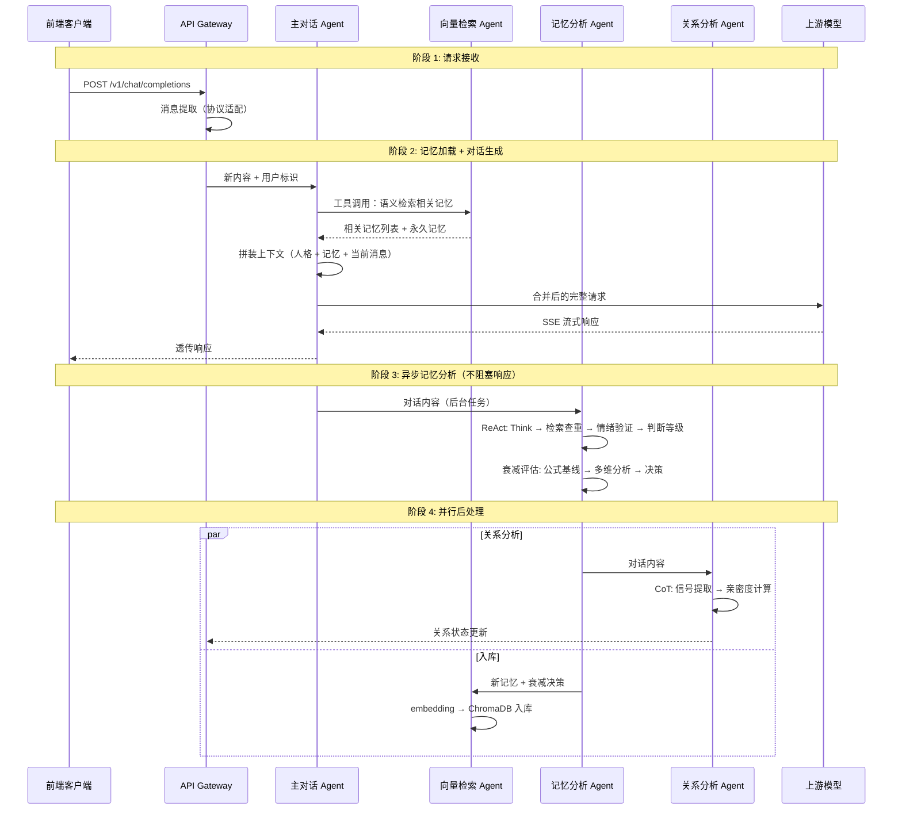

# 架构设计文档 | Architecture Design

> **系统版本**: v0.2.0
> **文档状态**: 设计中
> **创建时间**: 2026-03-24
> **最后更新**: 2026-07-11
> **作者**: HarryHelloo

---

## 1. 概述 (Overview)

**Mnemosync** 是一个基于 **LangGraph 多 Agent 编排**的跨平台人格记忆管理系统。

技术上，它是位于 LLM 前端（客户端）与后端（模型提供商）之间的智能中间件。其核心价值不在于转发，而在于**让 AI 人格拥有持续、统一的记忆** — 无论用户从哪个平台（机器人、桌宠、Web）接入，AI 都能记得"你是谁、你之前说过什么、你们的关系走到了哪一步"。

### 1.1 核心定位

> **当前版本 (v0.2.x)** 为**单人格架构** — 一个 Mnemosync 实例对应一个人格配置。多个 API Key 用于区分不同前端来源（如 AstrBot、AIRI 桌宠、Web 聊天室），而非多用户隔离。所有前端共享同一份记忆池和人格配置。

### 1.2 核心价值主张

| 维度 | 传统方案 | Mnemosync 方案 |
|------|----------|---------------|
| **记忆存储** | 按平台/会话分库隔离 | 统一记忆池 + 语义检索 |
| **记忆衰减** | 固定规则或无衰减 | Agent 精细化多维度评估 |
| **隐私控制** | 开放共享或简单隔离 | `source_restricted` 默认 + 细粒度策略 |
| **前端适配** | 各前端独立配置 | 统一人格，差异化清洗策略 |
| **去重** | MD5 哈希精确匹配 | embedding 语义相似度检索 |

> **核心理念**：记忆不是为了"隔离数据"，而是为了"在合适的关系语境下，唤起合适的记忆，表达合适的情感，遵守合适的边界"。

---

## 2. 设计原则 (Design Principles)

| 原则 | 说明 | 约束 |
|------|------|------|
| **Agent 驱动决策** | 记忆分析、衰减评估、检索由 Agent 智能执行，非确定性管道 | Agent 间通过 LangGraph StateGraph 通信 |
| **预处理优先 (Pre-process First)** | 所有记忆加载、合并必须在**转发请求前**完成 | 禁止依赖上游模型处理上下文 |
| **兼容即插即用 (Drop-in Compatibility)** | 严格遵循 OpenAI API 规范 | 前端无需修改代码，仅需更改 API Base/Key |
| **流式透传 (Streaming Passthrough)** | 支持 SSE 流式响应零缓冲透传 | 确保用户首字延迟 (TTFT) 不受显著影响 |
| **记忆不删除 (Soft Forget)** | 衰减是优先级降低，不是物理删除 | 遗忘记忆在检索时可恢复 |
| **永久记忆限额** | 永久记忆上限 15 条，防止上下文稀释 | 核心记忆（名字、过敏）不可覆盖 |
| **重要性与持久性分离** | 重要不代表长期，长期不代表重要 | 三个独立维度：importance, decay_rate, expires_at |

---

## 3. 系统架构 (System Architecture)

### 3.1 架构范式：从管道到 Agent

```
v0.1.0（旧）：确定性管道
  Gateway → Pipeline → Forwarder
  所有决策由固定算法完成

v0.2.0（新）：LangGraph 多 Agent 编排
  用户消息 → 主对话 Agent ⇄ 向量检索 Agent（工具调用）
              ↓ 对话完成后
           记忆分析 Agent（ReAct: 提取 + 衰减评估）
              ↓
           向量检索 Agent（入库 + 索引更新）

           并行辅助：
           关系分析 Agent（CoT，分析亲密度变化）

           可选前置：
           代理思考 Agent（CoT，用户启用时在主对话前执行）
```

### 3.2 Agent 拓扑总览

```
                              ┌──────────────────────┐
                              │   主对话 Agent        │
                              │   推理: 直接调用大模型  │
                              │   工具: 向量检索工具    │
                              └──────┬───────────────┘
                                     │ 加载记忆 + 生成回复
                                     │ 对话完成后触发分析
                                     ↓
                    ┌────────────────────────────────────┐
                    │         记忆分析 Agent              │
                    │         推理: ReAct                 │
                    │         工具: 向量检索 + 情绪分析    │
                    │              + 时间衰减计算         │
                    │         输出: 候选记忆 + 衰减决策    │
                    └────────────┬───────────────────────┘
                                 │
                    ┌────────────┴────────────┐
                    ↓                         ↓
        ┌───────────────────┐    ┌───────────────────────┐
        │   向量检索 Agent    │    │   关系分析 Agent       │
        │   推理: 无（工具执行）│    │   推理: CoT            │
        │   入库 + 索引更新    │    │   工具: 情绪分析工具   │
        └─────────┬─────────┘    └───────────┬───────────┘
                  │                          │
                  └──────────┬───────────────┘
                             ↓
                    ┌────────────────────┐
                    │   长期记忆存储       │
                    │   ChromaDB + SQLite │
                    └────────────────────┘

                    并行可选：
                    ┌──────────────────────┐
                    │  代理思考 Agent (可选) │
                    │  推理: CoT             │
                    │  工具: 向量检索 + 情绪  │
                    │  仅在用户启用时执行     │
                    │  在主对话 Agent 之前    │
                    └──────────────────────┘
```

### 3.3 模块职责

| 模块 | 类型 | 职责 |
|------|------|------|
| **API Gateway** | 基础设施 | API Key 鉴权、请求格式校验、前端来源识别、消息提取 |
| **主对话 Agent** | Agent | 加载人格+记忆+关系状态，生成回复 |
| **记忆分析 Agent** | Agent (ReAct) | 分析对话提取记忆候选 + 评估已有记忆衰减状态 |
| **代理思考 Agent** | Agent (CoT) | 可选启用；在弱推理模型上显式 CoT，注入主对话上下文 |
| **向量检索 Agent** | Agent (工具) | embedding 语义检索 + reranker 精排 + 入库索引 |
| **关系分析 Agent** | Agent (CoT) | 分析亲密度变化，更新关系状态 |
| **Forwarder** | 基础设施 | 上游连接池、SSE 透传（保留旧架构） |
| **消息提取** | 基础设施 | OpenAI messages 格式 → 新内容提取（协议适配） |

### 3.4 LangGraph StateGraph 设计

```python
# 状态定义（概念示意）
class AgentState(TypedDict):
    # 请求上下文
    messages: list[dict]           # 当前请求的 messages（OpenAI 格式）
    extracted_new: list[dict]      # 提取出的新内容
    source_user: str               # 来源用户标识
    persona: str                   # 人格 system prompt

    # 记忆检索结果
    retrieved_memories: list[dict] # 语义检索到的相关记忆
    permanent_memories: list[dict] # 永久记忆（始终加载）

    # 记忆分析结果
    candidate_memories: list[dict] # 新提取的记忆候选
    memory_tags: dict              # 情绪标签 + 记忆等级

    # 衰减评估结果
    decay_decisions: dict          # 每条记忆的衰减决策

    # 关系状态
    relationship: dict             # 当前用户的关系状态
    relationship_delta: dict       # 本轮对话的关系变化

    # 最终输出
    merged_context: list[dict]     # 合并后的上下文
    response: str                  # 生成的回复
```

**节点与边**：

```
START
  │
  ├─[条件路由: proxy_thinking_enabled?]── 是 ──→ proxy_thinking → main_dialogue
  │                                          否 ──→ main_dialogue
  ▼
[parse_request] ─── 消息提取 + 鉴权（基础设施）
  │
  ▼
[main_dialogue] ─── 主对话 Agent
  │                  ├─ 调用向量检索 Agent（tool call）
  │                  ├─ 加载永久记忆
  │                  ├─ 加载代理思考结果（如有）
  │                  ├─ 拼装上下文
  │                  └─ 生成回复 → 流式返回
  │
  ▼ （异步，对话完成后执行）
[memory_analysis] ─── 记忆分析 Agent (ReAct)
  │                    ├─ 提取新记忆候选
  │                    └─ 评估已有记忆衰减
  │
  ├──────┬──────[relationship_analysis] ─── 关系分析 Agent (CoT)
  ▼      ▼
[vector_index] ─── 向量检索 Agent（入库 + 更新索引）
  │
  ▼
 END
```

**条件路由**：

- `parse_request` → 若 `proxy_thinking_enabled` → `proxy_thinking` → `main_dialogue`；否则直接 → `main_dialogue`
- `main_dialogue` 完成后 → 若有新对话内容 → 进入 `memory_analysis`
- `memory_analysis` 产出新记忆 + 衰减决策 → `vector_index`；并行 → `relationship_analysis`
- 若记忆分析判断"无需存储任何内容" → 跳过 `vector_index`，直接 END

---

## 4. 推理方法分布 (Reasoning Methods)

课程要求 ≥1 种推理/规划方法。本系统使用 **3 种**：

| Agent | 推理方法 | 具体表现 |
|-------|----------|----------|
| **记忆分析 Agent** | **ReAct** | 分析对话提取记忆候选 + 批评估已有记忆衰减状态 |
| **代理思考 Agent** | **CoT** | 理解意图 → 回顾记忆 → 分析需求 → 制定回复策略（用户可选启用） |
| **关系分析 Agent** | **CoT** | 提取对话信号 → 分析亲密度影响 → 综合计算增量 |
| **主对话 Agent** | 直接推理（大模型自身） | 加载记忆+人格+关系，生成自然对话 |
| **向量检索 Agent** | 无（工具执行） | 调用 embedding API + 相似度计算 |

---

## 5. 记忆机制 (Memory Mechanisms)

课程要求 ≥2 种记忆机制。本系统使用 **2 种**：

### 5.1 短期记忆 — LangGraph Checkpoint

```
实现方式：LangGraph 内置 checkpoint 机制
存储内容：当前会话的完整对话历史
生命周期：会话期间
作用：让主对话 Agent 在同一会话内能回顾上文
```

LangGraph 的 `MemorySaver` 会自动在每次节点执行后保存状态快照。同一 `thread_id` 下的多次请求共享同一个 checkpoint，天然提供短期记忆能力。

### 5.2 长期记忆 — ChromaDB + SQLite

```
实现方式：ChromaDB 存储向量 + SQLite 存储元数据
存储内容：MemoryEntry（content, importance, decay_rate, emotional_tags, ...）
生命周期：持久化，按衰减模型管理
检索方式：embedding 语义检索 → cosine 粗筛 → reranker 精排
```

长期记忆沿用旧设计的双类型体系（永久记忆 + 普通记忆）和衰减模型，详见 [记忆系统设计文档](modules/memory-system.md)。

---

## 6. 工具列表 (Tools)

课程要求 ≥2 种工具。本系统使用 **3 种**：

| 工具 | 调用者 | 功能 |
|------|--------|------|
| **向量语义检索工具** | 主对话 Agent、记忆分析 Agent | embedding 向量化 → ChromaDB 相似度检索 → reranker 精排 |
| **情绪分析工具** | 记忆分析 Agent、关系分析 Agent | 调用辅助模型分析文本情绪，输出情感标签 + 强度 |
| **时间衰减计算工具** | 记忆分析 Agent | 计算时间衰减因子、半衰期、优先级，作为 Agent 决策的量化参考基线 |

详见 [工具设计文档](modules/tools.md)。

---

## 7. 数据流时序 (Request Lifecycle)



> **设计约束**：
> - 阶段 2 的记忆检索必须是本地操作（ChromaDB）或低延迟 API 调用（embedding），确保 TTFT 不受显著影响。
> - 阶段 3-4 必须**异步**执行，不得阻塞响应返回给用户。
> - embedding 调用的延迟是主要瓶颈，需权衡精度和速度。

---

## 8. 技术栈 (Tech Stack)

| 组件 | 技术选型 | 说明 |
|------|----------|------|
| **Agent 编排** | LangGraph + LangChain | StateGraph, node/edge, 条件路由, checkpoint |
| **主模型（主对话）** | DashScope qwen-max | 高质量对话生成 |
| **辅助模型（分析/衰减）** | DashScope qwen-turbo | 低成本推理，ReAct/CoT |
| **嵌入模型** | DashScope text-embedding-v3 | 文本 → 向量 |
| **重排序模型** | DashScope gte-rerank | 候选精排 |
| **向量存储** | ChromaDB | 嵌入式向量数据库，轻量部署 |
| **元数据存储** | SQLite + aiosqlite | 记忆元数据、关系状态、配置 |
| **API 服务** | FastAPI | API Gateway 层 |
| **HTTP 客户端** | httpx | 上游转发、DashScope API 调用 |
| **Python** | ≥ 3.12 | |

---

## 9. 与旧架构的关系

| 旧模块 | 处理方式 |
|--------|----------|
| **Forwarder** (`src/modules/forward/`) | ✅ 保留 — 仍是基础设施，上游转发逻辑不变 |
| **消息提取** (`src/modules/extraction/`) | ✅ 保留 — 协议适配层，归入 API Gateway |
| **上下文合并** (`src/modules/context/`) | ❌ 替换 — 由主对话 Agent 内部完成 |
| **MemoryStore** (`src/modules/memory/store.py`) | ♻️ 重构 — SQLite 部分保留，新增 ChromaDB 向量存储 |
| **MemoryEntry** (`src/modules/memory/models.py`) | ♻️ 重构 — 新增 importance, decay_rate, memory_type 字段 |
| **API Routes** (`src/api/routes/`) | ♻️ 重构 — 转发端点保留，内部改为 Agent 编排 |
| **CLI / 认证 / 配置** | ✅ 保留 — 不是课程重点但项目完整度高 |

---

## 10. 扩展点设计 (Extension Points)

1. **Agent 替换**：每个 Agent 实现为独立的 LangGraph 节点，可独立替换 prompt 或模型
2. **工具扩展**：新工具只需实现 LangChain Tool 接口，注册到对应 Agent 即可
3. **存储后端**：ChromaDB 可替换为 Milvus/Weaviate 等
4. **嵌入模型**：text-embedding-v3 可替换为其他 embedding 服务
5. **多人格支持（未来）**：当前单人格架构预留了 persona_id 字段

---

## 11. 约束与边界 (Constraints & Boundaries)

- ❌ **不训练模型**：仅做上下文管理和 Agent 编排
- ❌ **不存储敏感日志**：默认不记录完整对话至磁盘，仅存储必要记忆条目
- ❌ **不破解上游限制**：若上游不支持某些功能，代理层不凭空创造
- ❌ **不保证 100% 记忆永久**：受限于 Token 窗口和衰减策略
- ❌ **单人格架构（当前版本）**：一个实例仅支持一个人格

---

## 12. 版本历史 (Version History)

| 版本 | 日期 | 变更说明 |
|------|------|----------|
| v0.1.0 | 2026-03-29 | 初始架构：确定性管道 (Gateway → Pipeline → Forwarder) |
| v0.2.0 | 2026-07-12 | 重构为 LangGraph 多 Agent 架构；ReAct/CoT 推理；embedding 语义检索；ChromaDB 向量存储；代理思考 Agent |

---

> **维护者提示**:
> - 记忆模型是 Mnemosync 的灵魂。任何修改 Agent 职责边界或记忆衰减逻辑的变更，必须经过核心维护者审查。
> - Agent 的 prompt 模板和推理循环设计应保持独立可测试。
> - LangGraph StateGraph 是核心编排骨架，修改节点/边关系前需确认对整体数据流的影响。