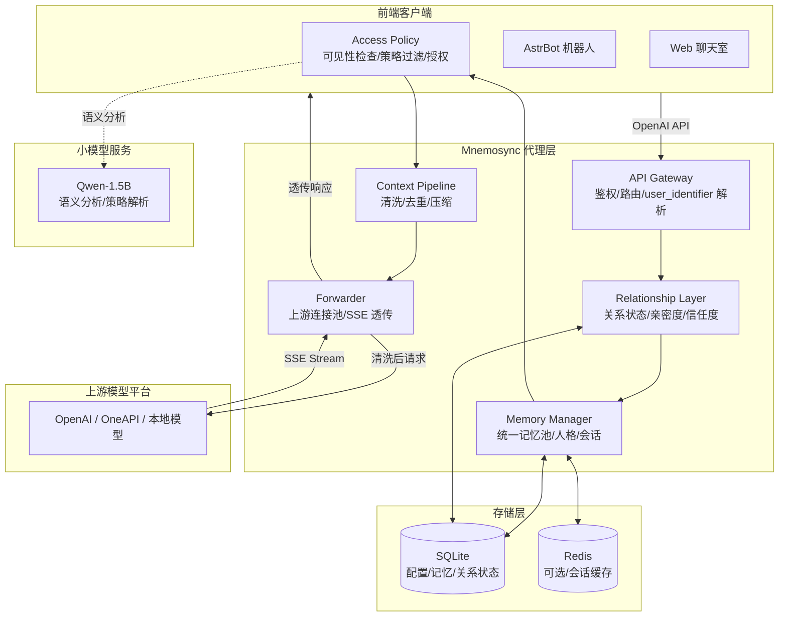
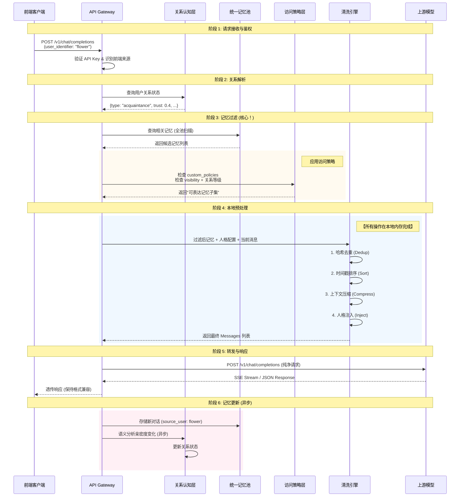

# 架构设计文档 | Architecture Design

> **系统版本**: v0.1.0  
> **文档状态**: 初稿  
> **创建时间**: 2026-03-24  
> **最后更新**: 2026-03-29  
> **作者**: HarryHelloo  
> **最后更新**: HarryHelloo  

---

## 1. 概述 (Overview)

**Mnemosync** 是一个位于 LLM 前端（客户端）与后端（模型提供商）之间的**智能代理中间件**。

技术上，它是一个反向代理服务器，但其核心价值不在于转发，而在于**上下文编排**与**人格记忆管理**。它拦截标准的 OpenAI 兼容请求，在本地完成人格记忆加载、关系状态解析、记忆访问策略过滤、上下文合并后，再将"纯净"的请求转发给上游模型。

本项目旨在解决多平台对话场景下**人格记忆碎片化**的问题，通过技术手段模拟人类记忆的连续性与情境性。

### 1.1 核心定位

> ⚠️ **重要**：当前版本 (v0.x) 为**单人格架构** —— 一个 Mnemosync 实例对应一个人格配置。
> 
> 多个 API Key 用于区分不同前端来源（如 AstrBot、AIRI 桌宠、Web 聊天室），而非多用户隔离。
> 所有前端共享同一份记忆池和人格配置。

### 1.2 核心价值主张

| 维度 | 传统方案 | Mnemosync 方案 |
|------|----------|---------------|
| **记忆存储** | 按平台/会话分库隔离 | 统一记忆池 + 来源标记 |
| **关系认知** | 无关系概念 | 语义自动演化亲密度/信任度 |
| **隐私控制** | 开放共享或简单隔离 | `source_restricted` 默认 + 细粒度策略 |
| **前端适配** | 各前端独立配置 | 统一人格，差异化清洗策略 |

> **核心理念**：记忆不是为了"隔离数据"，而是为了"在合适的关系语境下，唤起合适的记忆，表达合适的情感，遵守合适的边界"。

---

## 2. 设计原则 (Design Principles)

本系统的架构决策遵循以下核心原则，所有贡献者应予以遵守：

| 原则                                 | 说明                         | 约束                           |
|------------------------------------|----------------------------|------------------------------|
| **预处理优先 (Pre-process First)**      | 所有记忆合并、清洗、压缩必须在**转发请求前**完成 | 禁止依赖上游模型处理上下文去重或记忆管理         |
| **无状态转发 (Stateless Forwarding)**   | 代理层不维护运行时对话状态，状态持久化至存储层    | 便于水平扩展，重启不丢失记忆               |
| **兼容即插即用 (Drop-in Compatibility)** | 严格遵循 OpenAI API 规范         | 前端无需修改代码，仅需更改 API Base/Key   |
| **轻量级部署 (Lightweight)**            | 针对个人服务器优化，低资源占用            | 默认不使用重型依赖（如完整向量库），支持 SQLite  |
| **流式透传 (Streaming Passthrough)**   | 支持 SSE 流式响应零缓冲透传           | 确保用户首字延迟 (TTFT) 不受代理层显著影响    |
| **统一记忆 (Unified Memory)**          | 所有用户记忆存储在同一个逻辑池中           | 通过 `source_user` 和访问策略进行逻辑隔离 |
| **关系感知 (Relationship Aware)**      | 人格能识别不同用户及彼此关系             | 亲密度/信任度基于语义自动演化              |
| **隐私优先 (Privacy First)**           | 默认保护用户隐私                   | 默认可见性为 `source_restricted`   |
| **策略可控 (Policy Controllable)**     | 用户可定义细粒度分享规则               | 支持自然语言策略解析 + 授权流程            |

---

## 3. 系统架构 (System Architecture)



### 模块职责简述

1.  **API Gateway**: 入口网关，负责 API Key 鉴权、请求格式校验、**前端来源识别**、`user_identifier` 解析。
    > **注意**：当前版本所有 API Key 共享同一人格配置，"Persona ID 路由"是未来多人格架构的预留设计。
2.  **Relationship Layer**: 关系认知层，查询/更新用户关系状态（亲密度、信任度、关系类型），支持语义自动演化。
3.  **Context Pipeline**: 核心清洗引擎，执行去重、排序、压缩算法。
4.  **Memory Manager**: 记忆存储抽象层，管理**统一记忆池**、人格配置、会话历史。
5.  **Access Policy**: 访问策略层，执行记忆可见性检查、自定义策略过滤、跨用户授权（预留）。
6.  **Forwarder**: 上游客户端，维护连接池，处理流式响应透传。
7.  **Storage**: 持久化层，默认 SQLite，支持扩展 Redis/PostgreSQL。
8.  **SmallLLM**: 小模型服务（可选），用于亲密度语义分析、策略解析、情绪标签提取。

---

## 4. 请求处理时序 (Request Lifecycle)

这是本系统最关键的逻辑流程，确保**记忆过滤和策略应用发生在转发前**。



> ⚠️ **设计约束**：
> - 阶段 2-4 必须是同步或异步本地操作，**严禁**在阶段 2-4 发起任何外部网络请求（除非调用本地或云端小模型），以确保延迟可控。
> - 阶段 6 的记忆更新必须**异步**执行，不得阻塞响应返回。

---

## 5. 核心模块设计 (Core Modules)

### 5.1 关系认知层 (Relationship Layer)

负责管理人格与每个用户的关系状态，**基于语义自动演化**。

```python
# 概念模型示意 (非代码实现)
class RelationshipLayer:
    def get_relationship(persona_id: str, user_id: str) -> RelationshipState
    def update_relationship(persona_id: str, user_id: str, delta: RelationshipDelta) -> None
    def analyze_intimacy_change(conversation: Conversation) -> RelationshipDelta  # 调用小模型
```

**关系状态数据结构**：
```yaml
relationships:
  "user:motor":
    type: "friend"              # stranger | acquaintance | friend | intimate
    intimacy_score: 0.72        # 0.0 ~ 1.0，语义自动计算
    trust_level: 0.85           # 0.0 ~ 1.0，语义自动计算
    interaction_count: 128
    last_active: 2026-03-23T21:30:00
    notes: "用户喜欢川菜，最近工作压力大"
```

**亲密度演化信号**：

| 信号类型 | 示例 | 亲密度影响 |
|----------|------|-----------|
| **称呼变化** | "你"→"亲爱的" "兄弟" | +0.05 ~ +0.1 |
| **隐私分享** | 用户主动透露私人信息 | +0.1 ~ +0.2 |
| **情感表达** | "我好难过"/"谢谢你" | +0.05 ~ +0.15 |
| **互动频率** | 每日多次对话 | +0.01/天 |
| **长时间沉默** | 超过 30 天无互动 | -0.01/天 |
| **疏远信号** | "别问了"/"不想说" | -0.1 ~ -0.2 |

> **实现方式**：调用云端小模型（如 Qwen-1.5B）分析对话语义，输出亲密度变化值（低频调用，仅对话结束时）。

### 5.2 统一记忆池 (Unified Memory Pool)

所有用户、所有情境的记忆存储在同一个逻辑池中，每条记忆携带元数据。

**MemoryEntry 结构**：
```python
# 记忆条目数据结构（概念示意）
class MemoryEntry:
    id: str                    # 唯一标识
    content: str               # 记忆内容
    source_user: str           # 记忆来源用户标识
    visibility: str            # public | friends_only | confidential | source_restricted
    custom_policies: list      # 用户自定义策略 ["deny:user:A", "allow:user:B"]
    emotional_tags: list       # 情感标签 ["sad", "happy", "stress"]
    relationship_snapshot: dict  # 记录时的关系状态快照
    created_at: datetime
    last_accessed: datetime
```

**默认可见性规则**：

| 记忆类型 | 默认可见性 | 说明 |
|----------|-----------|------|
| 用户偏好/习惯 | `source_restricted` | 仅来源用户可访问 |
| 情感事件 | `source_restricted` | 隐私优先 |
| 事实信息 | `source_restricted` | 如"用户叫马达" |
| 对话片段 | `source_restricted` | 默认不共享 |

### 5.3 访问策略层 (Access Policy Layer)

执行记忆可见性检查、自定义策略过滤。

**访问决策矩阵**：
```
当前用户 = X，查询记忆 M（来源用户 = Y）

决策流程：
1. 检查 M.custom_policies：
   - 若有 "deny:user:X" → ❌ 拒绝
   - 若有 "allow:user:X" → ✅ 允许（跳过后续检查）

2. 检查 M.visibility：
   - source_restricted 且 X ≠ Y → ❌ 拒绝
   - confidential 且 关系信任度 < 0.8 → ❌ 拒绝
   - friends_only 且 关系类型 < friend → ❌ 拒绝
   - public → ✅ 允许

3. 检查跨用户授权（预留）：
   - 若 M 涉及第三方 Z，且 Z 未授权 → ❌ 拒绝或触发授权流程
```

**用户独立策略示例**：
```
用户指令示例：
• "不要告诉 A 这件事"
• "B 的话，可以跟他讲呢"
• "这个只有你能知道"

解析后存储为：
custom_policies: [
  {"type": "deny", "user": "user:A"},
  {"type": "allow", "user": "user:B"},
  {"type": "confidential", "user": "current"}
]
```

### 5.4 上下文清洗引擎 (Context Pipeline)

采用**责任链模式 (Chain of Responsibility)**，每个处理器独立可插拔。

| 处理器 | 功能 | 算法策略 | 优先级 |
|--------|------|----------|--------|
| `DedupHandler` | 清除重复对话 | 内容哈希 (MD5) + 时间窗口滑动 | P0 (必须) |
| `SortHandler` | 统一时序逻辑 | 解析/生成 ISO 8601 时间戳并排序 | P0 (必须) |
| `CompressHandler` | 控制 Token 长度 | 滑动窗口截断 / 摘要替换 (预留) | P1 (可选) |
| `InjectHandler` | 注入人格提示词 |  prepend System Prompt / 合并策略 | P0 (必须) |

> **小模型使用边界**：对话去重/压缩**不使用**小模型，仅使用确定性算法。小模型仅用于关系/策略相关的语义理解。

### 5.5 转发器 (Forwarder)

-   **连接池**: 复用 `httpx.AsyncClient` 连接，减少 TCP 握手开销。
-   **流式处理**: 使用生成器 (Generator) 逐块读取上游响应并 yield 给客户端，避免内存堆积。
-   **错误降级**: 上游超时/错误时，返回标准 OpenAI 格式错误码，便于前端处理。

---

## 6. 数据模型 (Data Model)

### 6.1 核心实体

| 实体 | 存储位置 | 说明 |
|------|----------|------|
| `Persona` | SQLite | 人格配置（System Prompt, 上游 Key, 清洗策略，关系演化配置） |
| `Session` | SQLite | 会话元数据（创建时间，最后活跃时间，关联 Persona，user_identifier） |
| `Message` | SQLite | 原始对话记录（角色，内容，时间戳，哈希值，source_user） |
| `MemoryEntry` | SQLite | 结构化记忆（content, source_user, visibility, custom_policies, emotional_tags, relationship_snapshot, created_at, last_accessed, expires_at） |
| `Relationship` | SQLite | 关系状态（persona_id, user_id, type, intimacy_score, trust_level, interaction_count, last_active, notes） |

### 6.2 数据库 Schema (SQLite)

```sql
-- 记忆条目表
CREATE TABLE memory_entries (
    id TEXT PRIMARY KEY,
    content TEXT NOT NULL,
    source_user TEXT NOT NULL,
    visibility TEXT DEFAULT 'source_restricted',
    custom_policies TEXT,       -- JSON 数组
    emotional_tags TEXT,        -- JSON 数组
    relationship_snapshot TEXT, -- JSON 对象
    created_at TIMESTAMP,
    last_accessed TIMESTAMP,
    expires_at TIMESTAMP
);

-- 关系状态表
CREATE TABLE relationships (
    persona_id TEXT NOT NULL,
    user_id TEXT NOT NULL,
    type TEXT DEFAULT 'stranger',
    intimacy_score REAL DEFAULT 0.0,
    trust_level REAL DEFAULT 0.0,
    interaction_count INTEGER DEFAULT 0,
    last_active TIMESTAMP,
    notes TEXT,
    PRIMARY KEY (persona_id, user_id)
);

-- 索引优化
CREATE INDEX idx_source_user ON memory_entries(source_user);
CREATE INDEX idx_visibility ON memory_entries(visibility);
CREATE INDEX idx_persona_user ON relationships(persona_id, user_id);
```

### 6.3 消息结构 (OpenAI 兼容)

代理层内部处理的消息格式严格遵循 OpenAI 标准，扩展字段通过 `metadata` 或内部数据库关联，不污染发给上游的 Payload。

```json
// 发送给上游的最终格式
{
  "model": "gpt-4",
  "messages": [
    {"role": "system", "content": "你是墨小末..."},
    {"role": "user", "content": "你好", "name": "马达"},
    {"role": "assistant", "content": "你好呀！"}
  ],
  "stream": true
}
```

---

## 7. 扩展点设计 (Extension Points)

以下模块应当设计明确的扩展接口：

1.  **清洗策略 (`CleanerStrategy`)**:
    *   开发者可自定义去重算法（如语义去重而非哈希去重）。
    *   实现接口：`clean(messages: list) -> list`
2.  **存储后端 (`MemoryStore`)**:
    *   默认 SQLite，可扩展 PostgreSQL/MySQL 适配器。
    *   实现接口：`save_entry()`, `query_entries()`
3.  **关系演化策略 (`RelationshipEvolution`)**:
    *   自定义亲密度/信任度演化算法。
    *   实现接口：`analyze(conversation) -> Delta`, `apply_signals(signals) -> Delta`
4.  **访问策略 (`AccessPolicy`)**:
    *   自定义记忆可见性决策逻辑。
    *   实现接口：`can_access(memory, current_user, relationship) -> bool`
5.  **情境匹配 (`ContextMatcher`)**:
    *   未来用于三层记忆模型的情境激活逻辑。
    *   实现接口：`match(request_meta) -> list[layer_names]`

---

## 8. 部署拓扑 (Deployment Topology)

### 8.1 单节点部署 (推荐)

适用于个人用户，所有组件运行在同一 Docker Compose 栈中。

```
[Client] --> [Nginx] --> [Mnemosync Backend] --> [SQLite]
                               ^
                               |
                         [Mnemosync Frontend]
```

### 8.2 多节点部署 (未来支持)

适用于多人格/多用户 SaaS 场景，需引入 Redis 共享会话状态。

> **注意**：当前版本为单人格架构，不支持多节点部署。此章节为未来规划预留。

```
[Client] --> [Load Balancer] --> [Backend Instance 1] --+
                                                       +--> [Redis Cluster]
[Client] --> [Load Balancer] --> [Backend Instance 2] --+
```

---

## 9. 约束与边界 (Constraints & Boundaries)

明确本系统**不做**什么，以避免需求蔓延：

-   ❌ **不训练模型**: 本系统仅做上下文管理，不涉及 Fine-tuning 或 Pre-training。
-   ❌ **不存储敏感日志**: 默认不记录完整对话日志至磁盘，仅存储必要记忆条目（隐私保护）。
-   ❌ **不破解上游限制**: 若上游模型本身不支持某些功能（如 Function Call），代理层无法凭空创造。
-   ❌ **不保证 100% 记忆永久**: 受限于 Token 窗口和压缩策略，早期记忆可能会被摘要化或遗忘（模拟人类特性）。
-   ❌ **不承诺 100% 隐私**: 策略依赖正确配置，用户需理解系统边界。
-   ❌ **单人格架构 (当前版本)**: 一个 Mnemosync 实例仅支持一个人格配置，多人格支持是未来规划。

---

## 10. 版本历史 (Version History)

| 版本     | 日期     | 变更说明                                      |
|--------|--------|-------------------------------------------|
| v0.0.0 | undone | 初始架构设计，仅转发 OpenAI API                     |
| v0.1.0 | undone | 确立"预处理优先"原则；引入统一记忆池、关系认知层、访问策略层；小模型用于语义分析 |

---

> **维护者提示**:
> - 任何修改核心数据流（尤其是清洗时序）的 PR，必须引用本架构文档并说明理由。
> - 记忆模型是 Mnemosync 的灵魂。任何修改关系演化逻辑或访问控制策略的变更，必须经过核心维护者审查，确保不破坏"统一记忆 + 关系感知 + 隐私优先"的设计哲学。
