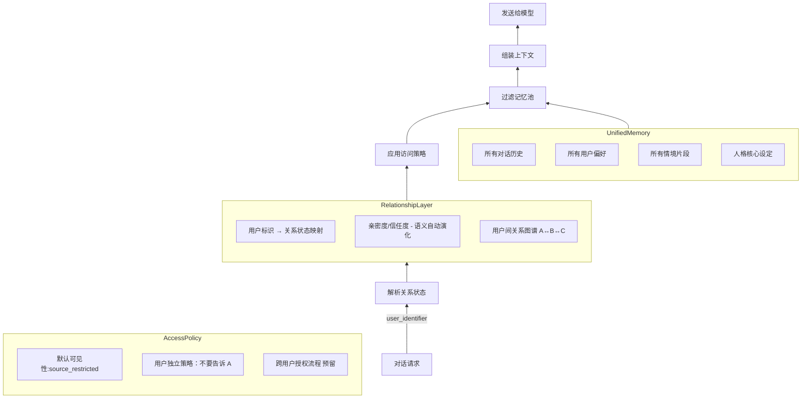
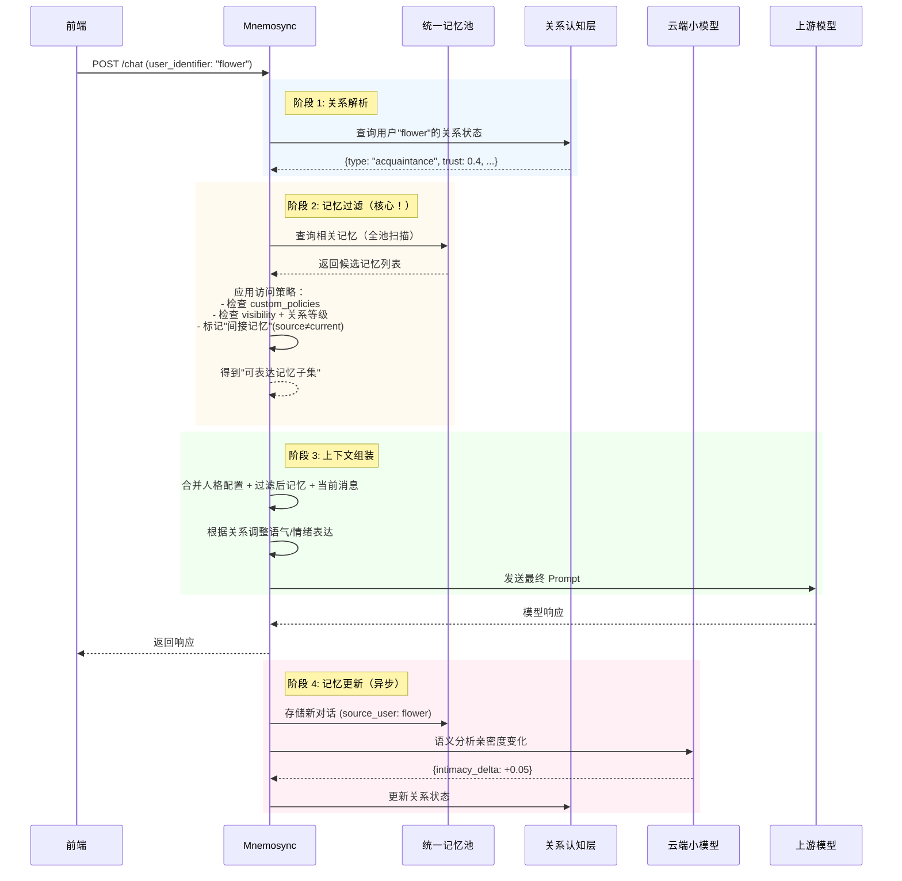
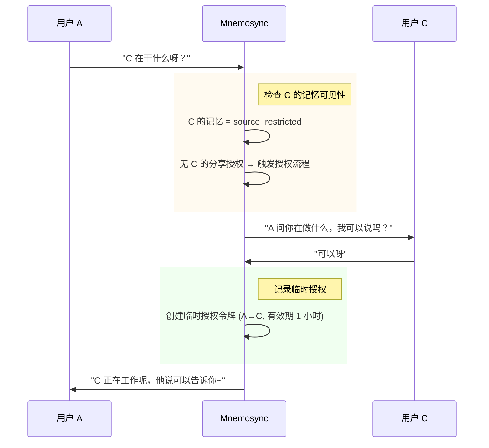

# 记忆模型设计文档 | Memory Model Design

> **系统版本**: v0.0.0  
> **文档状态**: 初稿  
> **创建时间**: 2026-03-24  
> **最后更新**: 2026-03-24  
> **作者**: HarryHelloo  
> **最后更新**: HarryHelloo  

---

## 1. 设计哲学 (Design Philosophy)

**Mnemosync** 的记忆模型不是"对话日志存储"，而是**对人类社交认知过程的抽象模拟**。

### 1.1 人类记忆的社交本质


人类如何处理多关系记忆  
- 统一记忆池：所有经历存储在同一个"大脑"中  
- 关系感知：能识别"这是马达""那是小花""这是 C"  
- 亲疏有别：对陌生人疏远，对朋友亲近   
- 隐私控制："这个不能告诉 A，但可以和 B 说"   
- 社交中介："A 问你事，我能转达吗？"   


### 1.2 核心原则

| 原则 | 说明 | 传统方案 | Mnemosync 方案 |
|------|------|----------|----------------|
| **统一记忆** | 所有用户记忆存储在同一个逻辑池中 | 按用户分库隔离 | 统一存储 + 策略过滤 |
| **关系感知** | 人格能识别不同用户及彼此关系 | 无关系概念 | 语义自动判断亲密度 |
| **隐私优先** | 默认保护用户隐私 | 开放共享或简单隔离 | `source_restricted` 默认 |
| **策略可控** | 用户可定义细粒度分享规则 | 无或粗粒度 | 支持独立策略 + 授权流程 |
| **社交智能** | 人格可作为用户间的沟通中介 | 不支持 | 预留跨用户授权机制 |

> **核心理念**：  
> 记忆不是为了"隔离数据"，而是为了"在合适的关系语境下，唤起合适的记忆，表达合适的情感，遵守合适的边界"。

---

## 2. 记忆架构 (Memory Architecture)

### 2.1 核心组件



### 2.2 统一记忆池 (Unified Memory Pool)

所有用户、所有情境的记忆存储在同一个逻辑池中，每条记忆携带元数据：

```python
# 记忆条目数据结构（概念示意）
class MemoryEntry:
    id: str                    # 唯一标识
    content: str               # 记忆内容
    source_user: str           # 记忆来源用户标识
    visibility: str            # public | friends_only | confidential | source_restricted
    custom_policies: list      # 用户自定义策略 ["deny:user:A", "allow:user:B"]
    emotional_tags: list       # 情感标签 ["sad", "happy", "stress"]
    relationship_snapshot: dict  # 记录时的关系状态快照
    created_at: datetime
    last_accessed: datetime
```

**数据库 Schema（SQLite）**：
```sql
CREATE TABLE memory_entries (
    id TEXT PRIMARY KEY,
    content TEXT NOT NULL,
    source_user TEXT NOT NULL,
    visibility TEXT DEFAULT 'source_restricted',
    custom_policies TEXT,       -- JSON 数组
    emotional_tags TEXT,        -- JSON 数组
    relationship_snapshot TEXT, -- JSON 对象
    created_at TIMESTAMP,
    last_accessed TIMESTAMP,
    expires_at TIMESTAMP
);

-- 索引优化
CREATE INDEX idx_source_user ON memory_entries(source_user);
CREATE INDEX idx_visibility ON memory_entries(visibility);
```

### 2.3 关系认知层 (Relationship Layer)

记录人格与每个用户的关系状态，**基于语义自动演化**：

```yaml
# 关系状态数据结构（概念示意）
relationships:
  "user:motor":
    type: "friend"              # stranger | acquaintance | friend | intimate
    intimacy_score: 0.72        # 0.0 ~ 1.0，语义自动计算
    trust_level: 0.85           # 0.0 ~ 1.0，语义自动计算
    interaction_count: 128
    last_active: 2026-03-23T21:30:00
    notes: "用户喜欢川菜，最近工作压力大"
    
  "user:flower":
    type: "acquaintance"
    intimacy_score: 0.2
    trust_level: 0.4
    interaction_count: 12
    notes: "刚认识不久"
```

#### 亲密度自动演化规则

| 信号类型 | 示例             | 亲密度影响 |
|----------|----------------|-----------|
| **称呼变化** | "你"→"亲爱的" "兄弟" | +0.05 ~ +0.1 |
| **隐私分享** | 用户主动透露私人信息     | +0.1 ~ +0.2 |
| **情感表达** | "我好难过"/"谢谢你"   | +0.05 ~ +0.15 |
| **互动频率** | 每日多次对话         | +0.01/天 |
| **长时间沉默** | 超过 30 天无互动     | -0.01/天 |
| **疏远信号** | "别问了"/"不想说"    | -0.1 ~ -0.2 |

> **实现方式**：调用云端小模型分析对话语义，输出亲密度变化值（低频调用，仅对话结束时）。

### 2.4 访问控制策略 (Access Policy)

#### 默认可见性规则

| 记忆类型 | 默认可见性 | 说明 |
|----------|-----------|------|
| 用户偏好/习惯 | `source_restricted` | 仅来源用户可访问 |
| 情感事件 | `source_restricted` | 隐私优先 |
| 事实信息 | `source_restricted` | 如"用户叫马达" |
| 对话片段 | `source_restricted` | 默认不共享 |

#### 用户独立策略

用户可通过自然语言指令定义细粒度分享规则：

```
用户指令示例：
• "不要告诉 A 这件事"
• "B 的话，可以跟他讲呢"
• "这个只有你能知道"
• "如果 C 问起，你就说不知道"

解析后存储为：
custom_policies: [
  {"type": "deny", "user": "user:A"},
  {"type": "allow", "user": "user:B"},
  {"type": "confidential", "user": "current"},
  {"type": "deny", "user": "user:C"}
]
```

#### 访问决策矩阵

```
当前用户 = X，查询记忆 M（来源用户 = Y）

决策流程：
1. 检查 M.custom_policies：
   - 若有 "deny:user:X" → ❌ 拒绝
   - 若有 "allow:user:X" → ✅ 允许（跳过后续检查）

2. 检查 M.visibility：
   - source_restricted 且 X ≠ Y → ❌ 拒绝
   - confidential 且 关系信任度 < 0.8 → ❌ 拒绝
   - friends_only 且 关系类型 < friend → ❌ 拒绝
   - public → ✅ 允许

3. 检查跨用户授权（预留）：
   - 若 M 涉及第三方 Z，且 Z 未授权 → ❌ 拒绝或触发授权流程
```

---

## 3. 工作流程 (Workflow)

### 3.1 请求处理时序



### 3.2 跨用户授权流程（预留）



> **实现说明**：此功能为 v0.3+ 规划，v0.1 仅记录需求，不实现。

---

## 3.3 记忆存储流程 (Memory Storage)

### 存储时机

```
┌─────────────────────────────────────────────────────────────┐
│  消息处理流程                                                │
├─────────────────────────────────────────────────────────────┤
│                                                              │
│  ① 接收请求 → ② 鉴权 → ③ 加载记忆 → ④ 清洗 → ⑤ 转发上游    │
│                                                          ↓   │
│  ⑦ 存储记忆 ← ⑥ 上游响应 ← ⑧ 返回前端                      │
│   (异步，不阻塞)                                             │
│                                                              │
└─────────────────────────────────────────────────────────────┘
```

**关键原则**:
1. **异步存储** - 不阻塞响应返回，使用后台任务执行
2. **错误隔离** - 存储失败不影响用户响应
3. **完整记录** - 同时存储用户消息和助手回复
4. **默认隐私** - 默认可见性为 `source_restricted`

### 存储内容

| 字段 | 说明 | 示例 |
|------|------|------|
| `content` | 消息内容 | "我叫马达，最近工作压力大" |
| `role` | 消息角色 | `user` / `assistant` / `system` |
| `source_user` | 来源标识 | API Key ID 或用户标识 |
| `visibility` | 可见性 | `source_restricted` (默认) |
| `custom_policies` | 自定义策略 | `["deny:user:flower"]` |
| `emotional_tags` | 情感标签 | `["stress", "sad"]` |
| `created_at` | 创建时间 | ISO 8601 格式 |

### 异步存储实现

```python
# 伪代码示例
async def create_chat_completion(request, http_request):
    # 1. 发送到上游
    response = await forwarder.send(messages=...)
    
    # 2. 立即返回响应
    return JSONResponse(content=response)
    
    # 3. 异步存储 (不阻塞)
    asyncio.create_task(
        _store_conversation(
            messages=request.messages,
            response=response,
            api_key_id=http_request.state.api_key_id,
        )
    )
```

### 存储失败处理

| 失败场景 | 处理策略 |
|---------|---------|
| 数据库锁定 | 重试 3 次，每次间隔 100ms |
| 磁盘空间不足 | 记录错误日志，跳过存储 |
| 数据格式错误 | 记录错误日志，跳过存储 |
| 连接超时 | 重试 1 次，失败后放弃 |

**错误日志示例**:
```
[ERROR] Failed to store conversation: database is locked
  - messages: 2 entries
  - response: 1 entry
  - api_key_id: abc123...
  - action: Retrying in 100ms (attempt 1/3)
```

### 流式响应存储

对于流式响应，需要收集完整内容后存储：

```
数据流:
上游 → [分块 1][分块 2][分块 3]...[DONE] → 前端
              ↓
        收集所有分块
              ↓
        解析完整内容
              ↓
        异步存储
```

**解析逻辑**:
1. 跳过 `data: [DONE]` 标记
2. 提取每个分块的 `delta.content`
3. 拼接完整回复内容
4. 创建 MemoryEntry 存储

---

## 3.4 实现示例 (Implementation Example)

> **注意**: 当前版本为单人格架构，所有对话方视为同一人。
> `source_user` 字段预留用于未来多对话方扩展。

### 存储对话记录

```python
from src.modules.memory import MemoryEntry, Visibility, SqliteMemoryStore

store = SqliteMemoryStore("data/memories.db")
await store.init_db()

# 存储用户消息
entry = MemoryEntry.create(
    content="我叫马达，最近工作压力大",
    role="user",
    source_user="default",  # 当前版本固定值，未来扩展为对话方标识
    visibility=Visibility.SOURCE_RESTRICTED,
)
await store.save(entry)

# 存储助手回复 (属于同一对话)
entry = MemoryEntry.create(
    content="你好马达，听说你最近工作压力大，还好吗？",
    role="assistant",
    source_user="default",  # 与用户消息相同的 source_user
    visibility=Visibility.SOURCE_RESTRICTED,
)
await store.save(entry)
```

### 查询记忆

```python
# 查询所有记忆 (当前版本只有一个默认对话方)
memories = await store.query(
    source_user="default",
    limit=20,
)

for mem in memories:
    print(f"[{mem.created_at}] [{mem.role}] {mem.content}")
```

**输出示例**:
```
[2026-03-29 10:00:00] [user] 我叫马达，最近工作压力大
[2026-03-29 10:00:15] [assistant] 你好马达，听说你最近工作压力大，还好吗？
```

---

## 4. 配置设计 (Configuration)

### 4.1 关系演化配置

```yaml
# config.yaml
persona:
  relationship:
    # 关系类型定义
    types:
      - id: "stranger"
        min_intimacy: 0.0
        min_trust: 0.0
      - id: "acquaintance"
        min_intimacy: 0.2
        min_trust: 0.3
      - id: "friend"
        min_intimacy: 0.5
        min_trust: 0.6
      - id: "intimate"
        min_intimacy: 0.8
        min_trust: 0.85
    
    # 语义演化配置
    evolution:
      enabled: true
      llm_provider: "siliconflow"
      llm_model: "Qwen/Qwen2.5-1.5B-Instruct"
      analysis_frequency: "per_conversation"  # per_message | per_conversation | daily
      
      # 信号权重
      signal_weights:
        address_change: 0.1       # 称呼变化
        privacy_share: 0.15       # 隐私分享
        emotional_expression: 0.1 # 情感表达
        interaction_frequency: 0.05  # 互动频率 (每日)
        silence_decay: -0.01      # 沉默衰减 (每日)
        distancing_signal: -0.15  # 疏远信号
      
      # 边界保护
      bounds:
        max_intimacy_per_day: 0.2
        min_trust: 0.0
        max_trust: 1.0
```

### 4.2 访问策略配置

```yaml
persona:
  access_policy:
    # 默认可见性
    default_visibility:
      user_preferences: "source_restricted"
      emotional_events: "source_restricted"
      factual_info: "source_restricted"
      conversation_snippets: "source_restricted"
    
    # 关系等级 → 可访问可见性
    visibility_matrix:
      stranger: ["public"]
      acquaintance: ["public", "friends_only"]
      friend: ["public", "friends_only", "confidential"]
      intimate: ["*"]
    
    # 跨用户分享（预留）
    cross_user_sharing:
      enabled: false  # v0.1 禁用
      authorization_flow: "manual"  # manual | auto_prompt | always_deny
```

### 4.3 用户独立策略示例

```yaml
# 用户通过自然语言指令配置，存储为记忆元数据
# 示例：用户马达说"不要告诉小花我失业的事"

memory_entry:
  content: "用户马达失业了，心情低落"
  source_user: "user:motor"
  visibility: "confidential"
  custom_policies:
    - type: "deny"
      user: "user:flower"
      reason: "用户明确禁止"
      created_at: 2026-03-23T21:30:00
```

---

## 5. 小模型使用边界

| 任务 | 调用时机 | 频率 | 推荐模型 |
|------|----------|------|----------|
| 亲密度语义分析 | 对话结束时 | ~1 次/会话 | Qwen-1.5B |
| 独立策略解析 | 检测到策略指令时 | 低频 | Qwen-1.5B |
| 情绪标签提取 | 对话结束时 | ~1 次/会话 | Qwen-1.5B |
| 跨用户授权生成 | 触发授权流程时 | 极低频 | Qwen-1.5B |
| **对话去重/压缩** | **❌ 不使用** | - | - |

> **设计意图**：小模型仅用于"关系/策略"相关的语义理解，调用频率控制在会话级别，确保成本可控。

---

## 6. 约束与边界

| 约束 | 说明 |
|------|------|
| **不替代上游模型** | 记忆管理仅做上下文组装，复杂推理交给上游 |
| **不承诺 100% 隐私** | 策略依赖正确配置，用户需理解系统边界 |
| **不存储原始日志** | 默认仅存储结构化记忆，不保留完整对话 |
| **不保证跨人格共享** | 不同 persona_id 的记忆完全隔离 |
| **跨用户授权为预留** | v0.1 不实现，仅记录需求 |

---

## 7. 演进方向

| 版本       | 核心能力         | 关键特性                            |
|----------|--------------|---------------------------------|
| **v0.0** | 转发OpenAI API | 无其他功能,测试解析转发 API                |
| **v0.1** | 基础社交记忆       | 统一记忆池、关系演化、source_restricted 默认 |
| **v0.2** | 策略增强         | 自然语言策略解析、情绪表达调整                 |
| **v0.3** | 社交中介         | 跨用户授权流程、关系图谱推理                  |
| **v0.4** | 生态开放         | 插件系统、社区策略模板                     |

---

> **维护者提示**：  
> 记忆模型是 Mnemosync 的灵魂。任何修改关系演化逻辑或访问控制策略的变更，必须经过核心维护者审查，确保不破坏"统一记忆 + 关系感知 + 隐私优先"的设计哲学。
