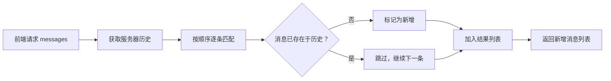

# 消息提取模块 | Message Extraction Module

> **系统版本**: v0.0.0  
> **文档状态**: 初稿  
> **创建时间**: 2026-03-24  
> **最后更新**: 2026-03-24  
> **作者**: HarryHelloo  
> **最后更新**: HarryHelloo  

---

## 1. 概述 (Overview)

消息提取模块是 Mnemosync 上下文清洗引擎 (**Context Pipeline**) 中的起点组件，负责**从前端请求的 messages 列表中提取新增对话内容**。

本模块确保在"同一人格，多个前端"的设计理念下，Mnemosync 能够准确识别并存储每次对话的新增部分，同时保持与服务器历史记忆的同步。

---

## 2. 问题背景 (Background)

### 2.1 设计挑战

Mnemosync 完全兼容 OpenAI API 规范，前端会发送完整的对话历史作为上下文：

```json
{
  "model": "gpt-4",
  "messages": [
    {"role": "user", "content": "你好", "name": "Alice"},
    {"role": "assistant", "content": "你好！有什么可以帮你的？"},
    {"role": "user", "content": "新问题", "name": "Alice"}  // ← 这才是新增内容
  ]
}
```

**核心问题**：服务器需要存储的只是**新增内容**，而非重复的历史。

### 2.2 场景分析

| 场景         | 前端行为        | 提取策略                  |
|------------|-------------|-----------------------|
| **一问一答**   | 仅发送最新一条用户消息 | 直接提取                  |
| **单人多轮对话** | 发送完整对话历史    | 提取最新一条或按列表匹配，提取未存储的部分 |
| **群聊混合**   | 多条交错的用户消息   | 逐条匹配，提取所有新消息          |
| **连接重试**   | 重复发送相同请求    | 在网络层处理，不进入本模块         |

### 2.3 设计目标

- **准确性**: 精确提取新增内容，不遗漏、不重复
- **性能**: 低延迟，不影响首字响应时间 (TTFT)
- **兼容性**: 适配所有遵循 OpenAI API 的前端应用
- **简洁性**: 逻辑清晰，避免过度设计

---

## 3. 实现原理 (Implementation)

### 3.1 数据结构

OpenAI API 的上下文结构为 JSON 中的消息列表：

```json
{
  "model": "gpt-4",
  "messages": [
    {"role": "system", "content": "你是一个幽默的助手"},
    {"role": "user", "content": "讲个笑话", "name": "马达"},
    {"role": "assistant", "content": "为什么程序员总是分不清万圣节和圣诞节？"},
    {"role": "user", "content": "为什么？", "name": "马达"}
  ]
}
```

每条消息的核心字段：
- `role`: 消息角色 (`system` | `user` | `assistant`)
- `content`: 消息内容
- `name`: (可选) 用户标识，用于群聊场景

### 3.2 提取算法

#### 3.2.1 核心思路

**列表顺序匹配**：按顺序遍历前端传来的 messages 列表，与服务器存储的历史进行匹配，剩余未匹配的部分即为新增内容。



#### 3.2.2 实现示意

*真实的实现比以下示例复杂*
```python
def extract_new_messages(messages: list, server_history: list) -> list:
    """
    从前端 messages 列表中提取新增消息
    
    Args:
        messages: 前端传来的完整消息列表
        server_history: 服务器已存储的历史消息
    
    Returns:
        新增消息列表
    """
    new_messages = []
    history_index = 0
    
    for msg in messages:
        # 在历史中查找匹配项
        while history_index < len(server_history):
            hist_msg = server_history[history_index]
            if _messages_equal(msg, hist_msg):
                history_index += 1
                break  # 找到匹配，跳过
            history_index += 1
        else:
            # 历史已遍历完，剩余的都是新消息
            new_messages.append(msg)
    
    return new_messages


def _messages_equal(a: dict, b: dict) -> bool:
    """判断两条消息是否相等"""
    return (
        a.get('role') == b.get('role') and
        a.get('content') == b.get('content') and
        a.get('name', '') == b.get('name', '')
    )
```

### 3.3 平台隔离

不同前端应用（通过 `api-key` 或 `platform_id` 标识）拥有独立的历史存储：

```python
class MessageExtractor:
    def __init__(self):
        self.histories = {}  # platform_id -> history_list
    
    def extract(self, messages: list, platform_id: str) -> list:
        history = self.histories.get(platform_id, [])
        new_messages = extract_new_messages(messages, history)
        
        # 更新历史
        self.histories[platform_id] = history + new_messages
        return new_messages
```

### 3.4 时间戳处理

对于新提取的对话内容，时间戳处理策略如下：

| 场景                  | 时间戳来源                        |
|---------------------|------------------------------|
| 前端传入 `timestamp` 字段 | 优先使用前端传入值                    |
| 无显式时间戳              | 使用服务器接收时间 (`datetime.now()`) |
| 群聊多条消息              | 保持前端传入的相对时序                  |

---

## 4. 模块集成 (Integration)

### 4.1 在 Context Pipeline 中的位置

消息提取模块是上下文清洗引擎的第一道处理器：

| 优先级    | 处理器               | 功能          |
|--------|-------------------|-------------|
| **P0** | `ExtractHandler`  | 提取新消息 (本模块) |
| **P0** | `SortHandler`     | 时间戳排序       |
| **P0** | `InjectHandler`   | 人格提示词注入     |
| **P1** | `CompressHandler` | Token 长度压缩  |

### 4.2 处理时序

提取操作在**本地内存**中完成，不发起任何外部网络请求，确保延迟可控。

详细时序请参考 [架构设计文档](../architecture.md#4-请求处理时序-request-lifecycle) 的 **阶段 4: 本地预处理**。

---

## 5. 配置选项 (Configuration)

| 配置项 | 类型 | 默认值 | 说明 |
|--------|------|--------|------|
| `extract.enabled` | bool | `true` | 是否启用消息提取 |
| `extract.platform_isolation` | bool | `true` | 是否启用平台隔离 |
| `extract.max_history_length` | int | `1000` | 单平台历史最大长度（超出则截断） |

---

## 6. 扩展点 (Extension Points)

未来版本计划支持以下扩展：

### 6.1 语义匹配

当前实现使用精确匹配，未来可支持语义相似度匹配：

```
用户： "早上好" (历史)
用户： "早啊" (新请求)  → 语义匹配识别为相同意图
```

### 6.2 时间窗口清理

自动清理过期历史，减少内存占用：

```python
def cleanup_old_history(platform_id: str, max_age_seconds: int):
    """清理超过指定时间的历史记录"""
    pass
```

### 6.3 自定义匹配策略

开发者可实现 `MessageMatcher` 接口来自定义匹配逻辑：

```python
class MessageMatcher:
    def is_match(self, msg1: dict, msg2: dict) -> bool:
        """返回 True 表示两条消息匹配"""
        pass
```

---

## 7. 测试用例 (Test Cases)

| 用例 ID | 场景描述 | 输入 | 预期输出 |
|--------|----------|------|----------|
| EXT-001 | 单用户新消息 | 历史 2 条，前端传 3 条（前 2 条匹配） | 提取第 3 条 |
| EXT-002 | 完全重复 | 前端消息与历史完全一致 | 返回空列表 |
| EXT-003 | 群聊多新消息 | 前端传 5 条，其中 3 条为新内容 | 提取 3 条新消息 |
| EXT-004 | 不同用户相同内容 | `name: A` 和 `name: B` 发送相同内容 | 均提取（群聊场景） |
| EXT-005 | 空消息列表 | `messages: []` | 返回空列表 |
| EXT-006 | 仅 system 消息 | 仅包含 system role | 提取 system 消息 |
| EXT-007 | 跨平台相同内容 | 不同 platform_id 发送相同内容 | 分别提取（平台隔离） |

---

## 8. 相关文档 (Related Documents)

- [架构设计文档](../architecture.md) - 系统整体架构
- [上下文清洗引擎](../architecture.md#54-上下文清洗引擎-context-pipeline) - Pipeline 设计
- [转发模块](forward.md) - 请求转发逻辑
- [记忆模型](../memory-model.md) - 记忆存储结构

---

## 9. 版本历史 (Version History)

| 版本 | 日期 | 变更说明 |
|------|------|----------|
| v0.0.0 | 2026-03-24 | 初始文档，定义基础消息提取方案 |
| v0.0.1 | 2026-03-24 | 重构：从"去重模块"改为"消息提取模块"，简化逻辑 |

---

> **维护者提示**:
> - 本模块是 Context Pipeline 的 P0 优先级组件，任何修改必须确保对话的完整性。
> - 重复请求应在网络层处理，不进入本模块。
> - 平台隔离需要合理管理内存，避免历史数据无限增长。
