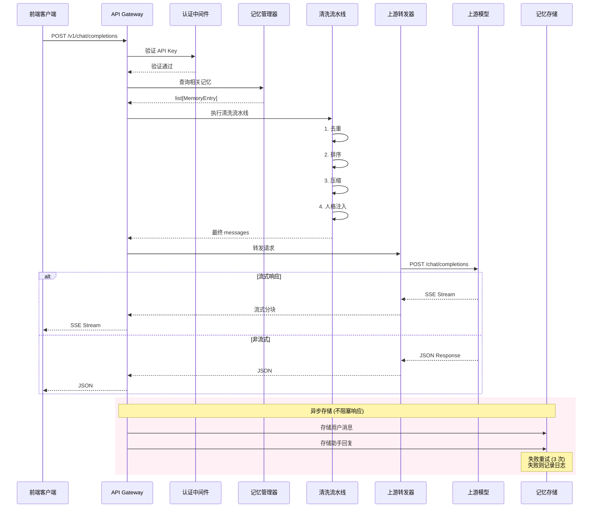

# 消息处理流程

> **模块版本**: v0.1.0
> **文档状态**: 初稿
> **创建时间**: 2026-03-29
> **最后更新**: 2026-03-29
> **作者**: HarryHelloo

---

## 1. 概述 (Overview)

本文档描述 Mnemosync 从接收前端请求到转发给上游模型的完整消息处理流程。

### 1.1 核心原则

| 原则 | 说明 |
|------|------|
| **预处理优先** | 所有记忆加载、清洗、合并必须在转发前完成 |
| **流式透传** | 上游的 SSE 流式响应零缓冲透传给前端 |
| **无状态转发** | 不维护运行时状态，状态持久化至存储层 |
| **OpenAI 兼容** | 请求/响应格式严格遵循 OpenAI API 标准 |

### 1.2 处理流程总览

```
┌─────────────────────────────────────────────────────────────────────┐
│  消息处理流水线 (Message Processing Pipeline)                        │
├─────────────────────────────────────────────────────────────────────┤
│                                                                      │
│  ① 接收请求 → ② API 鉴权 → ③ 解析消息 → ④ 加载记忆                  │
│       ↓                                                              │
│  ⑧ 转发上游 ← ⑦ 合并上下文 ← ⑥ 清洗提示词 ← ⑤ 筛选新消息            │
│       ↓                                                              │
│  ⑨ 流式响应 ← ⑩ 存储记忆                                             │
│                                                                      │
└─────────────────────────────────────────────────────────────────────┘
```

---

## 2. 流程步骤详解

### 步骤 1: 接收请求

**端点**: `POST /v1/chat/completions`

**请求头**:
- `Authorization: Bearer sk-<api-key>`
- `Content-Type: application/json`

**请求体** (OpenAI 兼容格式):
```json
{
  "model": "gpt-4",
  "messages": [...],
  "stream": true,
  "temperature": 0.7
}
```

---

### 步骤 2: API 鉴权

**验证内容**:
1. API Key 格式验证 (必须以 `sk-` 开头)
2. API Key 有效性验证 (存在于数据库且状态为 active)
3. 记录 API Key 使用时间 (异步，不阻塞请求)

**失败处理**:
- 格式错误 → `401 Invalid API key format`
- 无效/已撤销 → `401 Invalid or inactive API key`

**前端来源识别**:
```
API Key         →  前端来源
sk-abc12345...  →  AstrBot 机器人
sk-def67890...  →  AIRI 桌宠
sk-ghi11111...  →  Web 聊天室

所有 Key 共享同一人格配置和记忆池
```

---

### 步骤 3: 解析消息

**消息分类**:
| 角色 | 用途 |
|------|------|
| `system` / `developer` | 人格提示词、系统指令 |
| `user` | 用户消息 |
| `assistant` | 助手回复 |
| `tool` | 工具调用结果 |

**用户标识提取**:
1. 优先使用 `request.user` 字段
2. 从 `user` 消息的 `name` 字段提取
3. 无标识则视为匿名用户

---

### 步骤 4: 加载记忆

**查询条件**:
- 按来源用户筛选 (`source_user`)
- 按可见性过滤 (`visibility`)
- 按时间倒序 (最新的优先)
- 限制返回数量 (默认 20 条)

**记忆类型**:
- 用户偏好/习惯
- 情感事件
- 事实信息
- 对话片段

---

### 步骤 5: 可见性检查与消息筛选

**可见性规则**:

| 可见性 | 说明 |
|--------|------|
| `public` | 所有用户可见 |
| `friends_only` | 仅好友及以上关系可见 |
| `confidential` | 仅高信任度用户可见 |
| `source_restricted` | 仅来源用户可见 (默认) |

**新消息筛选**:
- 计算每条消息的哈希值
- 与数据库中已有哈希比对
- 哈希不存在的即为新消息

---

### 步骤 6: 提示词清洗

**清洗流水线**:

```
┌──────────────┐
│ 1. 去重       │  移除内容哈希重复的消息
└──────┬───────┘
       ↓
┌──────────────┐
│ 2. 排序       │  按时间戳统一时序 (旧→新)
└──────┬───────┘
       ↓
┌──────────────┐
│ 3. 压缩       │  截断超出 Token 限制的早期消息
└──────┬───────┘
       ↓
┌──────────────┐
│ 4. 人格注入   │  插入/替换 system prompt
└──────────────┘
```

---

### 步骤 7: 合并上下文

**合并顺序**:

```
[0] system: 人格提示词 ("你是墨小末...")
[1] system: 相关记忆 ("- 用户叫马达\n- 用户最近压力大...")
[2] user:   历史对话 1
[3] assistant: 历史回复 1
[4] user:   当前消息
```

---

### 步骤 8: 转发上游

**连接管理**:
- 使用连接池复用 HTTP 连接
- 配置超时时间 (连接 10s, 读取 30s)
- 限制最大连接数 (默认 100)

**请求格式**:
```json
{
  "model": "gpt-4",
  "messages": ["合并后的消息列表"],
  "stream": true,
  "temperature": 0.7
}
```

---

### 步骤 9: 流式响应透传

**SSE 格式**:
```
data: {"choices":[{"delta":{"content":"你"}}]}

data: {"choices":[{"delta":{"content":"好"}}]}

data: {"choices":[{"delta":{},"finish_reason":"stop"}]}

data: [DONE]
```

**透传原则**:
- 零缓冲，收到即转发
- 保持原始格式不变
- 确保首字延迟 (TTFT) 最小化

---

### 步骤 10: 异步记忆存储

**存储原则**:
| 原则 | 说明 |
|------|------|
| **异步执行** | 不阻塞响应返回，使用 `asyncio.create_task()` |
| **错误隔离** | 存储失败不影响用户响应，仅记录日志 |
| **完整记录** | 同时存储用户消息和助手回复 |
| **默认隐私** | 默认可见性为 `source_restricted` |

**存储流程**:
```
上游响应 → 收集完整内容 → 创建 MemoryEntry → SQLite 存储
                                    ↓
                              失败重试 (3 次)
                                    ↓
                              失败则记录日志
```

**存储内容**:
| 字段 | 说明 | 示例 |
|------|------|------|
| `content` | 消息内容 | "我叫马达，最近工作压力大" |
| `role` | 消息角色 | `user` / `assistant` |
| `source_user` | 来源标识 | API Key ID |
| `visibility` | 可见性 | `source_restricted` |
| `emotional_tags` | 情感标签 | `["stress", "sad"]` |
| `created_at` | 创建时间 | ISO 8601 格式 |

**流式响应处理**:
1. 收集所有 SSE 分块
2. 解析 `delta.content` 并拼接
3. 创建 MemoryEntry 存储

**关系更新** (异步):
- 调用小模型分析对话语义
- 更新亲密度/信任度
- 记录互动次数

**错误处理**:
| 失败场景 | 处理策略 |
|---------|---------|
| 数据库锁定 | 重试 3 次，每次间隔 100ms |
| 磁盘空间不足 | 记录错误日志，跳过存储 |
| 数据格式错误 | 记录错误日志，跳过存储 |

---

## 3. 完整时序图



---

## 4. 记忆存储详解 (Memory Storage Details)

### 4.1 为什么需要存储？

```
┌─────────────────────────────────────────────────────────────┐
│  Mnemosync 记忆同步原理                                      │
├─────────────────────────────────────────────────────────────┤
│                                                              │
│  用户在前端 A 说："我叫马达，最近工作压力大"                   │
│         ↓                                                    │
│  存储到 Mnemosync 记忆池                                     │
│         ↓                                                    │
│  用户在前端 B 问："你还记得我吗？"                           │
│         ↓                                                    │
│  从记忆池加载 → 模型回答："记得，你叫马达，最近工作压力大"    │
│                                                              │
└─────────────────────────────────────────────────────────────┘
```

如果不存储，就失去了 Mnemosync 的核心价值——**跨平台人格记忆同步**。

---

### 4.2 存储架构

```
src/modules/memory/
├── __init__.py          # 导出模块
├── models.py            # MemoryEntry, Visibility 枚举
└── store.py             # MemoryStore 协议，SqliteMemoryStore 实现
```

**MemoryEntry 数据结构**:
```python
@dataclass
class MemoryEntry:
    id: str                    # 唯一标识
    content: str               # 记忆内容
    role: str                  # user / assistant / system
    source_user: str | None    # 来源用户标识
    visibility: Visibility     # 可见性
    custom_policies: list[str] # 自定义策略
    emotional_tags: list[str]  # 情感标签
    created_at: datetime       # 创建时间
    last_accessed: datetime    # 最后访问时间
    expires_at: datetime       # 过期时间
```

**Visibility 枚举**:
| 值 | 说明 |
|------|------|
| `PUBLIC` | 公开，所有用户可见 |
| `FRIENDS_ONLY` | 仅好友可见 |
| `CONFIDENTIAL` | 仅高信任度用户可见 |
| `SOURCE_RESTRICTED` | 仅来源用户可见 (默认) |

---

### 4.3 SQLite 表结构

```sql
CREATE TABLE memory_entries (
    id TEXT PRIMARY KEY,
    content TEXT NOT NULL,
    role TEXT NOT NULL,
    source_user TEXT,
    visibility TEXT NOT NULL DEFAULT 'source_restricted',
    custom_policies TEXT,       -- JSON 数组，逗号分隔
    emotional_tags TEXT,        -- JSON 数组，逗号分隔
    created_at TIMESTAMP NOT NULL,
    last_accessed TIMESTAMP,
    expires_at TIMESTAMP
);

-- 索引优化
CREATE INDEX idx_source_user ON memory_entries(source_user);
CREATE INDEX idx_visibility ON memory_entries(visibility);
CREATE INDEX idx_created_at ON memory_entries(created_at DESC);
```

---

### 4.4 异步存储实现

```python
# src/api/routes/forward.py

async def create_chat_completion(request, http_request):
    """处理聊天请求."""
    
    # 1. 发送到上游
    response = await forwarder.send(messages=...)
    
    # 2. 立即返回响应
    return JSONResponse(content=response)
    
    # 3. 异步存储 (不阻塞)
    asyncio.create_task(
        _store_conversation(
            messages=request.messages,
            response=response,
            api_key_id=http_request.state.api_key_id,
        )
    )
```

**关键点**:
- 使用 `asyncio.create_task()` 创建后台任务
- 响应已经返回，存储失败不影响用户
- 错误仅记录日志，不抛出异常

---

### 4.5 流式响应存储

```python
async def _handle_stream(forwarder, messages, request):
    """处理流式请求."""
    
    collected_chunks = []
    
    async def stream_generator():
        async for chunk in forwarder.send_stream(messages=messages):
            collected_chunks.append(chunk)
            yield chunk
        
        # 流式结束后，异步存储
        asyncio.create_task(
            _store_streamed_conversation(
                messages=messages,
                chunks=collected_chunks,
            )
        )
    
    return StreamingResponse(stream_generator(), media_type="text/event-stream")
```

**解析逻辑**:
```python
def _parse_stream_chunks(chunks: list[bytes]) -> str:
    """从 SSE 分块提取完整内容."""
    content_parts = []
    
    for chunk in chunks:
        if chunk == b"data: [DONE]":
            continue
        
        data = json.loads(chunk[6:])  # 移除 "data: "
        if data.get("choices"):
            delta = data["choices"][0].get("delta", {})
            if delta.get("content"):
                content_parts.append(delta["content"])
    
    return "".join(content_parts)
```

---

### 4.6 错误处理策略

| 失败场景 | 处理策略 |
|---------|---------|
| **数据库锁定** | 重试 3 次，每次间隔 100ms |
| **磁盘空间不足** | 记录错误日志，跳过存储 |
| **数据格式错误** | 记录错误日志，跳过存储 |
| **连接超时** | 重试 1 次，失败后放弃 |

**错误日志格式**:
```
[ERROR] Failed to store conversation: database is locked
  - messages: 2 entries
  - response: 1 entry
  - api_key_id: abc123...
  - action: Retrying in 100ms (attempt 1/3)
```

---

### 4.7 使用示例

**存储用户消息**:
```python
from src.modules.memory import MemoryEntry, Visibility, SqliteMemoryStore

store = SqliteMemoryStore("data/memories.db")
await store.init_db()

entry = MemoryEntry.create(
    content="我叫马达，最近工作压力大",
    role="user",
    source_user="api-key-abc123",
    visibility=Visibility.SOURCE_RESTRICTED,
)
await store.save(entry)
```

**存储助手回复**:
```python
entry = MemoryEntry.create(
    content="你好马达，听说你最近工作压力大，还好吗？",
    role="assistant",
    source_user="assistant",
    visibility=Visibility.SOURCE_RESTRICTED,
)
await store.save(entry)
```

**查询记忆**:
```python
memories = await store.query(
    source_user="api-key-abc123",
    visibility=[Visibility.SOURCE_RESTRICTED, Visibility.PUBLIC],
    limit=20,
)

for mem in memories:
    print(f"[{mem.created_at}] {mem.content}")
```

---

## 5. 错误处理

| 错误 | HTTP 状态码 | 说明 |
|------|------------|------|
| 无效 API Key | 401 | API Key 不存在或已撤销 |
| 请求格式错误 | 400 | 请求体不符合 Schema |
| 上游服务错误 | 502 | 上游模型返回错误 |
| 上游超时 | 504 | 上游模型超时 |
| 服务器内部错误 | 500 | Mnemosync 内部错误 |

**错误响应格式**:
```json
{
  "error": {
    "message": "Invalid API key",
    "type": "invalid_request_error",
    "code": "invalid_api_key"
  }
}
```

---

## 5. 性能指标

| 指标 | 目标值 | 说明 |
|------|--------|------|
| API 鉴权延迟 | < 10ms | 数据库查询 |
| 记忆加载延迟 | < 50ms | SQLite 查询 |
| 清洗流水线延迟 | < 50ms | 确定性算法 |
| 首字延迟 (TTFT) | < 500ms | 包含上游响应时间 |

---

## 6. 数据流向

```
┌─────────────────────────────────────────────────────────────┐
│  数据流概览                                                  │
├─────────────────────────────────────────────────────────────┤
│                                                              │
│  前端请求 → API Gateway → 认证 → 消息解析                   │
│                              ↓                               │
│  记忆存储 ← 关系更新 ← 异步存储 ← 响应处理                  │
│       ↑                        ↑                            │
│       └────── 记忆加载 ────────┘                            │
│                              ↓                               │
│  上游模型 ← 连接池 ← 清洗流水线 ← 上下文合并                │
│       ↓                                                       │
│  流式响应 → 前端                                              │
│                                                              │
└─────────────────────────────────────────────────────────────┘
```

---

## 7. 与其他模块的关系

| 模块 | 关系说明 |
|------|----------|
| **API Key 管理** | 提供请求鉴权，标识来源用户 |
| **记忆管理** | 提供记忆加载与存储 |
| **关系认知** | 提供可见性检查依据 (未来) |
| **访问策略** | 提供记忆过滤规则 (未来) |
| **上下文清洗** | 执行去重/排序/压缩 |
| **上游转发** | 连接模型提供商 |

---

## 8. 版本历史

| 版本 | 日期 | 变更说明 |
|------|------|----------|
| v0.1.0 | 2026-03-29 | 初始流程设计 |

---

> **维护者提示**:
> - 任何修改核心数据流的 PR，必须引用本文档并说明理由
> - 确保所有预处理在转发前完成，严禁依赖上游处理上下文
> - 流式响应必须零缓冲透传，保证首字延迟不受影响
