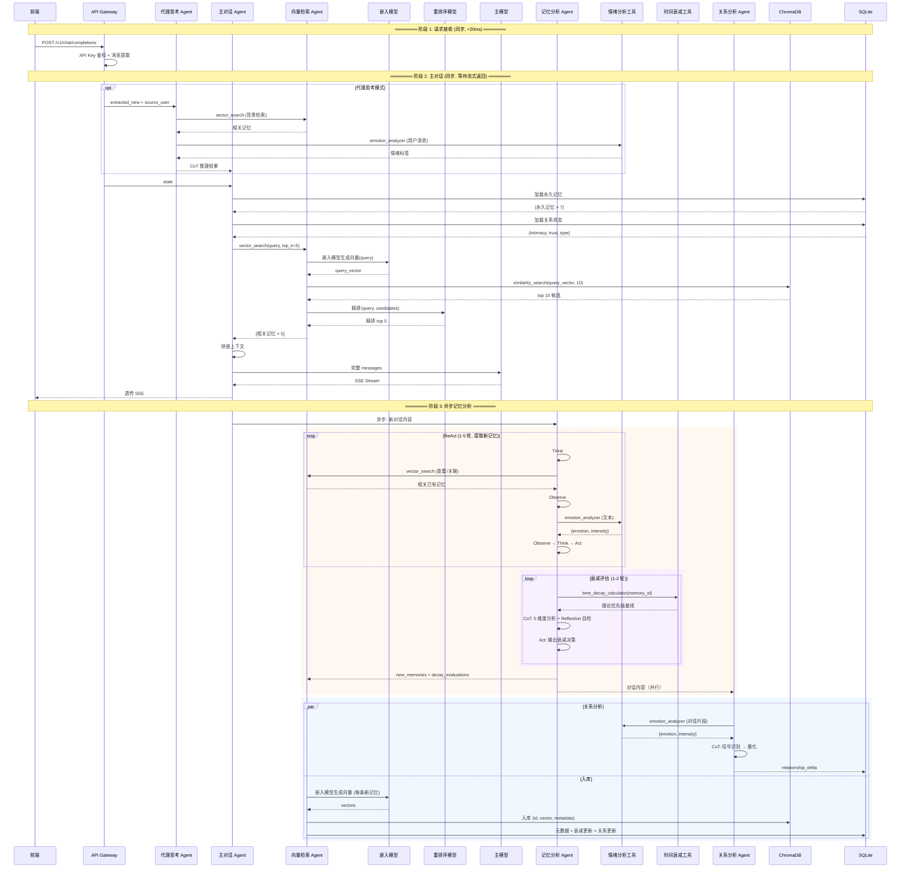

# 消息处理流程 | Message Processing Flow

> **系统版本**: v0.2.0
> **文档状态**: 设计中
> **创建时间**: 2026-03-29
> **最后更新**: 2026-07-12
> **作者**: HarryHelloo

---

## 1. 概述 (Overview)

本文档描述 Mnemosync v0.2.0 从接收前端请求到返回回复、再到异步记忆处理的完整流程。

### 1.1 核心变化 (v0.1.0 → v0.2.0)

| 维度 | v0.1.0（确定性管道） | v0.2.0（Agent 编排） |
|------|---------------------|---------------------|
| **处理模型** | 10 步线性管道 | LangGraph StateGraph 多节点编排 |
| **记忆加载** | SQL 查询 + 关键词匹配 | embedding 语义检索 + reranker 精排 |
| **记忆存储** | 直接 SQLite INSERT | 记忆分析 Agent (ReAct: 提取 + 衰减评估) → ChromaDB + SQLite |
| **短期记忆** | 无 | LangGraph checkpoint |
| **去重** | MD5 哈希 | 消息提取（精确匹配）+ Agent 语义查重（embedding） |
| **关系更新** | 无 | 关系分析 Agent (CoT) 并行执行 |

### 1.2 核心原则

| 原则 | 说明 |
|------|------|
| **预处理优先** | 所有记忆加载、合并必须在转发前完成 |
| **流式透传** | 上游 SSE 流式响应零缓冲透传给前端 |
| **异步后处理** | 记忆分析、入库不阻塞响应返回 |
| **Agent 隔离** | 单个 Agent 失败不影响其他 Agent 和主流程 |

---

## 2. 流程总览

```
                            ┌─────────────┐
                            │  前端请求    │
                            │  POST /v1/  │
                            │  chat/      │
                            │  completions│
                            └──────┬──────┘
                                   │
                            ┌──────▼──────┐
                            │  API Gateway │
                            │  鉴权 + 消息  │
                            │  提取        │
                            └──────┬──────┘
                                   │ state.messages, state.extracted_new
                                   │
                     (可选) 代理思考 Agent (CoT) ← state.proxy_thinking_enabled
                            ┌──────▼──────┐
                            │ 主对话 Agent │ ← vector_search (工具调用)
                            │  加载记忆    │ ← LangGraph checkpoint
                            │  拼装上下文  │
                            │  生成回复    │
                            └──┬──────┬───┘
                               │      │
                   流式返回给用户      │ state.extracted_new
                               │      │ （异步，不阻塞）
                               │      ▼
                               │ ┌──────────────┐
                               │ │ 记忆分析 Agent│ ← ReAct
                               │ │ 提取候选记忆  │ ← vector_search (查重/关联)
                               │ │ 判断等级+标签 │ ← emotion_analyzer
                               │ │ 衰减评估     │ ← time_decay_calculator
                               │ └──────┬───────┘
                               │        │
                               │   ┌────┴────┐
                               │   ▼         ▼
                               │ ┌──────┐ ┌──────────┐
                               │ │ 入库  │ │ 关系分析  │ （并行）
                               │ │向量化 │ │ Agent     │
                               │ │+索引 │ │ CoT       │
                               │ └──┬───┘ └────┬──────┘
                               │    │          │
                               │    └────┬─────┘
                               │         ▼
                               │ ┌──────────────┐
                               │ │ ChromaDB     │
                               │ │ + SQLite     │
                               │ └──────────────┘
                               │
┌──────────────────────────────┘
│  整个流程结束
│  用户早已收到回复
└──────────────────────────────
```

---

## 3. 流程步骤详解

### 阶段 1: 请求接收与预处理（基础设施）

**执行者**: API Gateway（非 Agent）

```
1. 接收 POST /v1/chat/completions
2. 验证 Authorization: Bearer sk-<api-key>
3. 解析 source_user（从 API Key 映射或 request.user 字段）
4. 读取 proxy_thinking_enabled（请求头 X-Enable-Proxy-Thinking）
5. 消息提取：messages → 剔除历史 → extracted_new
6. 写入 state: {messages, extracted_new, source_user, persona, thread_id, proxy_thinking_enabled}
```

**延迟约束**: 鉴权 < 10ms, 消息提取 < 10ms, 总计 < 20ms

---

### 阶段 2: 主对话生成（同步，阻塞流式返回）

**执行者**: 主对话 Agent（含可选的代理思考 Agent 前置步骤）

```
0. [可选] 若 proxy_thinking_enabled:
   → 代理思考 Agent (CoT): 理解意图 → 回顾记忆 → 分析需求 → 制定策略
   → 输出注入主对话 Agent 的 system prompt

1. 加载永久记忆（importance=1.0, memory_type=PERMANENT）
   → SQLite 直接查询，不经过 embedding（永久记忆始终全量加载）

2. 加载用户关系状态
   → SQLite 查询: {type, intimacy_score, trust_level, notes}

3. 语义检索相关普通记忆
   → 调用 vector_search(query=最新用户消息, top_k=5, source_user=...)
   → 内部流程: embedding → ChromaDB 粗筛 → reranker 精排 → 返回 top 5

4. 加载短期记忆
   → LangGraph checkpoint（同一 thread_id 的历史消息）

5. 拼装上下文
   [0] system: 人格 prompt + 永久记忆列表 + 检索记忆 + 关系摘要 (+ 代理思考结果)
   [1+] user/assistant: 当前对话历史（来自 checkpoint）

6. 调用主模型生成回复
   （代理思考模式下可用辅助模型替代主模型）

7. 流式透传 SSE 响应给前端
   → 零缓冲：收到即转发
   → 同步收集完整回复内容（供异步存储使用）

8. 异步触发阶段 3（不等待）
   → asyncio.create_task(阶段3)
```

**延迟约束**: 嵌入检索 < 150ms（可跳过 reranker 降至 50ms），TTFT（含上游模型）< 1s

---

### 阶段 3: 记忆分析（异步）

**执行者**: 记忆分析 Agent (ReAct)

**第一部分：提取新记忆**

```
ReAct 循环:

第 1 轮:
  Think: "用户说了什么新信息？有什么值得记的吗？"
  Act: vector_search(extracted_new 的文本, top_k=10)
  Observe: 已有记忆列表 → 判断是否重复/冲突/关联

第 2 轮（如有候选记忆）:
  Think: "这条信息是什么类型？重要性如何？是否永久？"
  Act: emotion_analyzer(候选记忆的原文)
  Observe: {emotion, intensity, category}

第 3 轮（如涉及永久记忆）:
  Think: "设为永久记忆需要检查限额。如超出需选一条覆盖。"
  Act: 输出最终决策（含 overrides 字段）
```

**第二部分：衰减评估（合并入同一 Agent）**

```
对每条需评估的已有普通记忆:

1. Act: time_decay_calculator(memory_id) → 理论优先级基线
2. Think: 综合 5 维度（时间基线、访问频率、情绪强度、关联性、对话佐证）
3. Think: Reflection 自检（是否过于依赖公式？是否遗漏情绪因素？）
4. Act: 输出衰减决策 {memory_id, new_priority, decision, factors, reflection}

自动跳过: 新创建（< 24h）的记忆
```

**输出**:
```json
{
  "new_memories": [...],
  "decay_evaluations": [...],
  "decay_summary": {...}
}
```

**约束**: 提取阶段 1-5 轮，衰减阶段 1-2 轮；异步执行，不阻塞用户

---

### 阶段 4: 关系分析 + 入库（异步，并行）

**并行节点 A**: 关系分析 Agent (CoT)

```
1. 调用 emotion_analyzer(本轮对话文本片段)
2. 识别信号: 称呼变化 / 隐私分享 / 情感表达 / 疏远信号
3. 量化影响: 每个信号 → 亲密度/信任度 delta
4. 综合计算: 当前值 + delta → 新值
5. 输出: {signals_detected, intimacy_delta, trust_delta, new_intimacy_score, new_relationship_type}
```

**并行节点 B**: 入库（向量检索 Agent）

```
1. 接收阶段 3 输出: 新记忆 + 衰减决策
2. 新记忆: content → 嵌入模型 → ChromaDB.add + SQLite INSERT
3. 衰减更新: SQLite UPDATE priority, is_forgotten
4. 关系更新: SQLite UPSERT relationships
5. 更新消息历史（供消息提取使用）
```

**并行说明**: 两个节点无数据依赖，可完全并行执行。一个失败不影响另一个。

---

## 4. 完整时序图



---

## 5. 错误处理

| 失败节点 | 影响范围 | 处理策略 |
|----------|----------|----------|
| **消息提取失败** | 阻塞主流程 | 返回 400 错误 |
| **代理思考失败** | 退化为正常模式 | 跳过，直接主对话 |
| **永久记忆加载失败** | 主对话缺少永久记忆 | 跳过，仅用 checkpoint + 检索记忆 |
| **vector_search 失败** | 主对话缺少语义记忆 | 跳过，仅用永久记忆 + checkpoint |
| **主模型调用失败** | 阻塞 | 返回 502 错误（UpstreamError） |
| **记忆分析 Agent 失败** | 本次对话不存储 | 记录日志，不阻塞回复 |
| **衰减评估失败** | 本次不更新衰减 | 记录日志，下次定期任务补做 |
| **关系分析 Agent 失败** | 本次不更新关系 | 记录日志 |
| **向量入库失败** | 记忆丢失 | 重试 3 次 + 记录日志 |

核心原则：**主路径上的失败 → 阻塞返回错误。异步路径上的失败 → 记录日志，不影响用户。**

---

## 6. 性能指标

| 指标 | 目标值 | 说明 |
|------|--------|------|
| 鉴权 + 消息提取 | < 20ms | SQLite 查询 + 精确匹配 |
| 代理思考（如启用） | +200-500ms | turbo 推理，不影响 TTFT（在主对话之前） |
| 永久记忆加载 | < 10ms | SQLite 索引查询 |
| embedding 检索（含 reranker） | < 300ms | 模型 API + ChromaDB 本地 |
| embedding 检索（不含 reranker，低精度模式） | < 100ms | 仅 ChromaDB cosine |
| 上下文拼装 | < 5ms | 内存操作 |
| 首字延迟 (TTFT) | < 1s | 含上游模型响应时间 |
| 异步后处理（阶段 3-4） | 1-5s | 不阻塞用户，后台执行 |

---

## 7. 与其他模块的关系

| 模块 | 关系说明 |
|------|----------|
| **API Gateway** | 提供鉴权 + 消息提取，写入 state |
| **代理思考 Agent** | 阶段 2 的可选前置步骤 |
| **主对话 Agent** | 阶段 2 的执行者 |
| **记忆分析 Agent** | 阶段 3 的执行者（包含提取和衰减评估） |
| **关系分析 Agent** | 阶段 4 的并行节点 |
| **向量检索 Agent** | 阶段 2（检索）+ 阶段 4（入库） |
| **Forwarder** | 主对话 Agent 通过它转发请求给上游模型 |
| **LangGraph StateGraph** | 整个流程的编排骨架 |
| **ChromaDB + SQLite** | 持久化层 |

---

## 8. 版本历史

| 版本 | 日期 | 变更说明 |
|------|------|----------|
| v0.1.0 | 2026-03-29 | 初始设计：10 步线性管道 (Gateway → Pipeline → Forwarder) |
| v0.2.0 | 2026-07-12 | 重构：LangGraph 多 Agent 编排；同步主路径 + 异步后处理；embedding 语义检索；ReAct/CoT 推理；衰减评估合并入记忆分析 Agent；新增代理思考 Agent |

---

> **维护者提示**:
> - 主路径（阶段 1-2）的任何改动必须确保 TTFT < 1s 的约束。
> - 异步路径（阶段 3-4）的 Agent 顺序和并行关系由 LangGraph 节点/边定义，修改前确认无循环依赖。
> - 代理思考增加约 200-500ms 延迟——此模式应在请求头显式启用，而非默认。
> - 阶段 4 的两个并行节点（关系分析 + 入库）互不依赖，一个失败不应影响另一个。